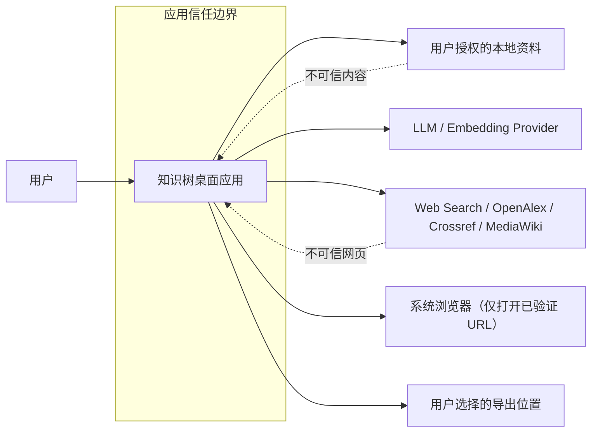
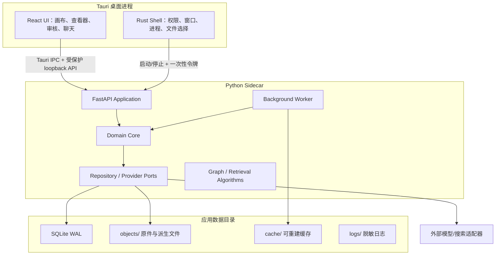
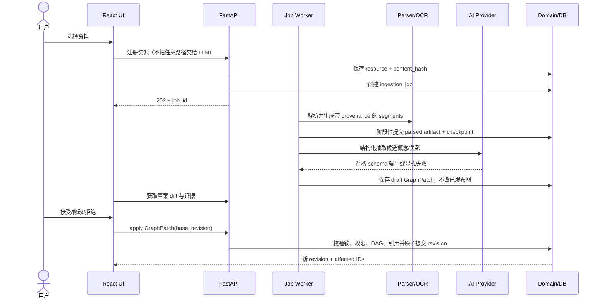
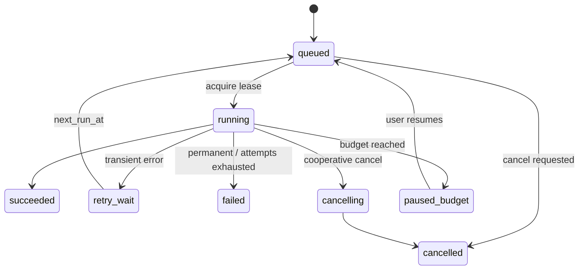
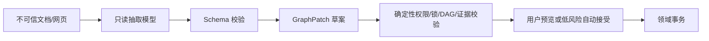

# 知识树 Agent：总体架构与技术基线指导书

> **文件标识：`!!! 工程框架指导 / Architecture Baseline`**  
> **版本：0.1（实施前技术基线）**  
> **日期：2026-08-12**  
> **状态：建议基线，尚未进入编码；所有“工程初值”必须在技术尖峰中用数据校准**  
> **上游事实源：`知识树Agent_可行性分析与项目Proposal.md` v0.1**  
> **配套流程：`!!!_【开发运维总纲】知识树Agent_全生命周期开发流程_v0.1.md`**  
> **LLM 兼容基线：`!!!_【多LLM兼容基线】知识树Agent_DeepSeek优先适配与配置_v0.1.md`**  
> **阅读顺序：先读 Proposal 理解产品，再读本文件决定如何实现，最后按开发运维总纲执行与留证**

> **2026-08-13 需求增补**：首版定位已明确为个人 AI Agent App；学科复核与 QA 由确定性 harness 编排职责隔离的 AI 子 Agent执行。机器证明、同源性披露和个人用户风险接受必须分离，详细需求与决策见 `docs/PRODUCT_REQUIREMENTS.md`、`docs/adr/ADR-0015-ai-review-harness.md`。

---

## 0. 本文件解决什么问题

Proposal 已回答“为什么做、做什么、价值与风险是什么”。本文件补齐真正开始编码前必须冻结的工程细节：

- 系统边界、进程边界、模块边界和依赖方向；
- 本地桌面版与云端版如何共用领域模型而不维护两套产品；
- 每个模块使用的数据结构、算法、技术和失败语义；
- 文档解析、来源锚点、知识图、版本、检索、AI 草案、人工锁定如何形成闭环；
- API、任务、事件、幂等、并发、撤销、重建与迁移契约；
- 安全、隐私、可观测性、测试和阶段验收门；
- 可参考的相似开源工程、可借鉴范围和不可照搬之处。

本文件不是代码清单，也不代表工程已经完成。当前文件夹中尚无 Git 仓库、产品代码或 `AGENTS.md`；已有实施前文档、开发日志和运维日志骨架，但没有运行证据。

---

## 1. 架构结论先行

### 1.1 产品本质

本产品不是普通脑图，也不是把通用 RAG 聊天套一层图形界面。它是一个：

> **以规范化概念为核心、以先修 DAG 为学习投影、以原始资料锚点为证据、以人工修改为最高优先级、由 AI 持续提出可审核变更的本地优先知识系统。**

必须长期保持五个不变量：

1. 概念与“概念在文档中的一次出现”分离；
2. 认知层级、来源归属、画布位置分离；
3. AI 只能产生候选或 `GraphPatch`，不能绕过领域校验直接写表；
4. 用户确认、锁定和固定位置的优先级高于任何自动重建；
5. 任何可见知识结论都能回到来源，定位失败必须显式显示，不能静默跳错。

### 1.2 架构形态

采用“**模块化单体 + 可替换端口适配器 + 独立后台 Worker**”，暂不拆微服务：

- 桌面壳：Tauri 2 / Rust；
- 前端：React + TypeScript；
- 本地应用服务：Python FastAPI sidecar；
- AI/解析 Worker：Python，同一代码库、独立进程；
- 领域核心：纯 Python 模块，不依赖 FastAPI、Docling、某家 LLM SDK 或具体数据库；
- 本地持久化：SQLite + FTS5 + 受控文件目录；
- 云端持久化：PostgreSQL + pgvector + S3 兼容对象存储；
- 图编辑：React Flow；分层布局：ELK.js；
- PDF 查看：PDF.js；解析：Docling 为主、PyMuPDF 为补充；
- 图约束与离线图算法：NetworkX；
- LLM、Embedding、OCR、Web Search 都通过 Provider Port 接入。
- Agent 审查：确定性 review harness + content-addressed artifacts；学科、QA 和裁决角色只产结构化机器证明，不直接获得领域写权限。

### 1.3 对 Proposal 的一项重要修正：本地 MVP 不强制 PostgreSQL

Proposal 推荐 PostgreSQL + pgvector 作为主数据库，方向适合云端/团队版，但不适合作为首个可安装 Windows 桌面 MVP 的硬依赖。否则用户还要维护 PostgreSQL、Redis、MinIO 或 Docker，产品验证会被部署复杂度干扰。

本基线建议：

| 形态 | 数据库 | 检索 | 文件 | 任务队列 |
|---|---|---|---|---|
| 技术尖峰/本地 MVP | SQLite WAL + FTS5 | FTS5 + Python/NumPy 精确向量检索；小规模先不建 ANN | 应用受控目录 | SQLite 持久化 job 表 + 单机 Worker |
| 团队/云端 | PostgreSQL + pgvector | PostgreSQL FTS + pgvector HNSW + RRF/重排 | S3/MinIO | Redis + Dramatiq/Celery |

两种形态必须共享相同领域实体、仓储接口、迁移版本和 API DTO。禁止在业务层写 `if local_mode`；差异只允许存在于基础设施适配器和部署配置。

`sqlite-vec` 可作为后续实验，但其官方仓库仍明确提示 pre-v1、可能发生破坏性变化，因此不作为 v0.1 的硬依赖：[sqlite-vec](https://github.com/asg017/sqlite-vec)。

### 1.4 MVP 范围冻结建议

首个可验证闭环只做：

- Windows 单用户、本地优先；
- PDF + TXT/Markdown + JPG/PNG；
- PPTX 只要求解析与页级预览，不承诺形状级精确回跳；
- 一个课程样例：“微积分——连续性与可导性”；
- 30–50 个概念、40–80 条边、50 个金标锚点；
- 首家真实 LLM Provider 为 DeepSeek API，另保留确定性 mock Provider；DeepSeek 必须在契约测试、真实 smoke 和金标评测通过后才能启用；
- 手工图编辑、AI 草案审核、锁定、撤销/重做、重建不覆盖人工成果；
- harness 自动编排 AI 学科审查、QA 主动证伪和必要的分歧裁决；搜索/检索只读、可追溯、失败关闭；
- 本地混合检索和带来源回答；
- 不做多人协作、移动端、完整 GraphRAG 社区摘要、Neo4j、插件市场。

---

## 2. 架构驱动与质量属性

优先级从高到低如下：

| 优先级 | 质量属性 | 可测目标 |
|---:|---|---|
| P0 | 来源正确性 | 数字 PDF 页级准确率 ≥98%，区域级 ≥90%；错误时不误跳 |
| P0 | 人工成果保护 | 锁定节点/边/位置在所有 AI 重建测试中被误改次数为 0 |
| P0 | 数据完整性 | `prerequisite_of` 无自环、无有向环、边端点存在、证据可追溯 |
| P0 | 可恢复性 | 应用或 Worker 中断后，任务可从最近完成阶段恢复；写操作可撤销 |
| P1 | 可解释性 | AI 节点/边包含证据、理由、置信度、模型和 prompt/schema 版本 |
| P1 | 机器审查可追溯性 | 学科与 QA 使用独立 run/prompt/context；每个结论绑定证据，模型同源时自动降级披露 |
| P1 | 可替换性 | 更换 LLM/Embedding/Parser 不修改领域层和数据库业务语义 |
| P1 | 本地可用性 | 不安装 Docker/数据库服务也能运行本地 MVP |
| P1 | 性能 | 500 个可见节点的拖拽/缩放保持交互流畅；API 常规读 P95 <200ms（工程初值） |
| P2 | 可扩展性 | 到达升级门槛后可切 PostgreSQL/pgvector，而不重写 UI 与领域模型 |
| P2 | 互操作 | 可导出带版本的 JSON/JSON-LD；概念标签尽量兼容 SKOS 语义 |

说明：以上阈值中除 Proposal 已提出者外均是“工程初值”，必须由阶段 0 基准测试确认。

---

## 3. 系统上下文、信任边界与数据流

### 3.1 系统上下文



PDF、网页、图片、OCR 文本都属于“不可信数据”，即使它们写着“忽略之前指令”也不能获得系统指令或工具权限。

### 3.2 容器/进程架构



### 3.3 本地 sidecar 通信约束

Tauri 可将 Python API 打包为 sidecar；官方文档给出了嵌入外部二进制及参数白名单方式：[Tauri Sidecar](https://tauri.app/develop/sidecar/)。推荐协议：

1. Tauri 启动 sidecar，绑定 `127.0.0.1` 随机空闲端口；
2. 每次启动生成 256-bit 随机 bearer token，通过继承管道或环境注入，禁止写日志；
3. sidecar 只接受 loopback、精确允许的 Origin 和 token；
4. UI 不自行拼本地路径，文件操作经 Tauri capability 或已注册的 `resource_id`；
5. sidecar 退出、失联或 token 轮换时，UI 进入只读恢复状态；
6. 不使用 Tauri localhost 插件承载前端静态资源；该插件官方明确提示有较高安全风险。前端继续使用 Tauri 默认 custom protocol。

未来可评估“所有调用经 Tauri IPC 代理”以进一步收紧端口面，但阶段 0 先验证受保护 loopback 是否足够稳定。

### 3.4 端到端数据流



---

## 4. 模块化单体的边界与依赖规则

### 4.1 领域模块

| 模块 | 职责 | 允许依赖 | 禁止事项 |
|---|---|---|---|
| `identity_workspace` | workspace、course、策略、配额 | shared kernel | 不包含登录供应商 SDK |
| `resource_catalog` | 资源注册、版本、哈希、授权路径映射 | workspace | 不直接解析文档 |
| `document_ingestion` | 阶段编排、解析、OCR、分块、派生物 | resource、provider ports | 不写知识图发布表 |
| `knowledge_graph` | concept、mention、edge、evidence、约束 | resource segment、revision | 不调用 LLM SDK |
| `graph_revision` | GraphPatch、版本、撤销、三方合并、锁 | knowledge_graph | 不把整图快照当唯一真相 |
| `retrieval` | FTS、向量、图扩展、RRF、重排 | resource、graph | 不生成最终答案 |
| `agent_application` | 意图解释、工具编排、草案/确认流程 | ports + use cases | 不拥有权限判断和 SQL 权限 |
| `source_resolution` | 锚点解析、漂移恢复、跳转结果 | resource、segment | 不静默使用低置信结果 |
| `research` | Web 搜索、来源评分、引用和许可元数据 | provider ports | 不默认镜像网页全文 |
| `job_control` | job、stage、lease、retry、progress | shared kernel | 不承载领域业务语义 |
| `observability` | trace、metrics、audit、cost | 所有模块事件 | 不记录密钥和原文全文 |

### 4.2 依赖方向

```text
UI / API / CLI
      ↓
Application Use Cases
      ↓
Domain Model + Domain Services
      ↓
Ports (Repository / Parser / LLM / Search / Clock / ID)
      ↑
Infrastructure Adapters (SQLite/Postgres/Docling/OpenAI/...)
```

硬规则：

- `domain/` 中不得 import FastAPI、SQLAlchemy、Docling、NetworkX、OpenAI SDK；
- NetworkX 是算法适配器，领域不变量仍须有可测试的纯函数定义；
- API DTO 与领域对象分离，禁止把 ORM model 直接返回前端；
- Provider 的原始响应只保存到受控 trace artifact，不渗透到领域表；
- 基础设施可以依赖领域端口，领域不能反向依赖基础设施；
- 每次跨模块写入由 Application Use Case 开启一个事务边界。

### 4.3 建议仓库结构

```text
knowledge-tree-agent/
├─ AGENTS.md
├─ README.md
├─ docs/
│  ├─ ARCHITECTURE.md                 # 本文件批准后的稳定副本
│  ├─ ENGINEERING_PLAN.md
│  ├─ DEVELOPMENT_LOG.md
│  ├─ OPS_LOG.md
│  ├─ USER_MANUAL.md
│  ├─ adr/                            # 一项重要决策一个 ADR
│  ├─ contracts/                      # JSON Schema / OpenAPI 快照
│  └─ evals/                          # 金标说明和评测报告
├─ config/
│  └─ llm/                            # 非敏感 Provider 与模型策略配置
├─ apps/
│  ├─ desktop/                        # Tauri/Rust
│  ├─ web/                            # React/TypeScript
│  ├─ api/                            # FastAPI composition root
│  └─ worker/                         # 后台任务入口
├─ packages/
│  ├─ domain/                         # 纯领域模型
│  ├─ application/                    # use cases
│  ├─ contracts-py/                   # Pydantic DTO
│  ├─ contracts-ts/                   # 从 JSON Schema 生成
│  ├─ infrastructure/                 # DB、对象、Provider 实现
│  └─ algorithms/                     # graph、retrieval、anchor
├─ migrations/
│  ├─ sqlite/
│  └─ postgres/
├─ prompts/
│  ├─ concept_extract/
│  ├─ relation_propose/
│  └─ command_interpret/
├─ tests/
│  ├─ unit/
│  ├─ contract/
│  ├─ integration/
│  ├─ e2e/
│  ├─ security/
│  └─ fixtures/
├─ evals/
│  ├─ calculus-v1/
│  └─ runner/
├─ scripts/
├─ docker/                            # 云端/CI，不是本地 MVP 必需
├─ pyproject.toml + uv.lock
├─ package.json + pnpm-lock.yaml
└─ .github/workflows/
```

前后端契约以 JSON Schema/OpenAPI 为单一事实源，自动生成 TypeScript 类型；不得手写两套同名 enum。

---

## 5. 领域模型与数据结构

### 5.1 聚合根

| 聚合根 | 内部实体/值对象 | 一致性边界 |
|---|---|---|
| `Workspace` | policy、quota、provider config refs | 资源必须归属 workspace；密钥只存引用 |
| `CourseGraph` | Concept、ConceptEdge、锁状态 | 一次 GraphPatch 原子校验并产生一个 revision |
| `Resource` | ResourceVersion、Segment、Anchor | 同一内容哈希可复用解析物；新内容产生新 version |
| `IngestionJob` | StageRun、ArtifactRef、Error | 每阶段只提交自身产物和 checkpoint |
| `ResearchSource` | URL、快照元数据、license、score | 引用可追溯，全文缓存受许可控制 |

`Revision` 不是独立业务真相，而是 `CourseGraph` 每次成功变更留下的审计记录。

### 5.2 标识、时间和枚举规范

- 业务主键：UUIDv7，便于离线生成和按时间排序；
- 内容身份：`sha256:<hex>`，用于原件/派生物去重，不替代业务 ID；
- 时间：数据库统一 UTC `timestamp with timezone`；UI 按用户时区显示；
- 所有 enum 持久化为稳定小写字符串，不依赖语言枚举序号；
- 所有可演进 JSON 必须带 `schema_version`；
- 删除采用 tombstone + `deleted_at`，资源彻底清除由单独 purge 流程执行；
- 用户可见排序不得依赖 UUID 或数据库默认顺序。

### 5.3 核心逻辑表

下表是逻辑模型；SQLite/PostgreSQL 的物理类型可不同，但字段语义必须一致。

#### `workspace` / `course`

```text
workspace(id, owner_id, name, policy_json, created_at, updated_at)
course(id, workspace_id, title, goal, audience, language,
       graph_revision_no, granularity_policy_json, created_at, updated_at)
```

`course.graph_revision_no` 是乐观并发版本号。每次发布图变更必须 `+1`。

#### `resource` / `resource_version`

```text
resource(id, workspace_id, kind[file|url|note], display_name,
         current_version_id, status, created_at, deleted_at)

resource_version(id, resource_id, version_no, content_hash, mime,
                 byte_size, page_count, storage_key,
                 parser_name, parser_version, parse_profile,
                 created_at, supersedes_id)
```

本地真实绝对路径不进入云端业务表；桌面模式另有本机私有映射：

```text
local_resource_binding(resource_id, canonical_path_ciphertext,
                       permission_scope, last_verified_at, missing_since)
```

#### `resource_segment`

```text
resource_segment(
  id, resource_version_id, ordinal, segment_type,
  text, normalized_text, text_hash,
  heading_path_json, page_or_slide,
  bbox_norm_json, char_start, char_end,
  language, token_count, parse_confidence,
  parent_segment_id, provenance_json, created_at
)
```

索引：

- unique `(resource_version_id, ordinal)`；
- `(resource_version_id, page_or_slide)`；
- `text_hash`；
- SQLite FTS5 / PostgreSQL `tsvector`；
- embedding 独立表，避免更换模型破坏 segment 主表。

#### `embedding_record`

```text
embedding_record(
  id, workspace_id, object_type, object_id,
  model_id, model_revision, dimension,
  text_hash, vector_ref_or_blob, created_at
)
```

unique `(object_type, object_id, model_id, model_revision, text_hash)`。更换 embedding 模型时新增记录，禁止原位覆盖。

#### `concept`

```text
concept(
  id, course_id, pref_label, normalized_label,
  aliases_json, definition, concept_type,
  granularity, scope_note, language,
  origin[user|ai|import], review_state,
  confidence, content_lock, relation_lock,
  created_revision_no, updated_revision_no,
  created_at, updated_at, deleted_at
)
```

约束：

- `pref_label` 不能为空；
- `confidence` 为 `[0,1]` 或 `NULL`，人工创建不伪造 AI 置信度；
- `content_lock` 与 `relation_lock` 分开，不能用一个布尔值表达所有锁；
- alias 规范化后在同一 concept 内去重；
- 相同 label 不强制唯一，因为学科语境可能不同；用 `scope_note` 与课程级消歧。

#### `concept_mention` / `edge_evidence`

```text
concept_mention(
  id, concept_id, segment_id, selector_json,
  exact_quote, confidence, extraction_run_id,
  review_state, created_at
)

edge_evidence(
  id, edge_id, segment_id, mention_id,
  exact_quote, rationale, evidence_kind,
  confidence, created_at
)
```

AI 提出的概念至少有一个 mention；AI 提出的 `prerequisite_of` 边至少有一个 evidence，除非明确标为 `unsupported_draft`，这种边不能自动发布。

#### `concept_edge`

```text
concept_edge(
  id, course_id, source_concept_id, target_concept_id,
  edge_type, origin, review_state, confidence,
  locked, rationale,
  created_revision_no, updated_revision_no,
  created_at, updated_at, deleted_at
)
```

核心约束：

- source != target；
- 端点必须属于同一 course；
- 对方向无意义的关系，存储时仍使用稳定 canonical ordering，API 再解释为无向；
- 活跃边 unique `(course_id, source, target, edge_type)`；
- `prerequisite_of` 活跃子图必须保持 DAG；
- 删除 concept 前必须通过 GraphPatch 明确处理相邻边，不依赖数据库 cascade 静默删除知识关系。

#### `layout_view` / `layout_item`

```text
layout_view(id, course_id, view_type, name, config_json, revision_no)
layout_item(view_id, concept_id, x, y, width, height,
            pinned, collapsed, lane_key, z_index, updated_at)
```

视图类型：`prerequisite`、`source_lane`、`free_canvas`。坐标是视图状态，不写入 concept。

#### `annotation`

```text
annotation(id, course_id, target_type, target_id, kind,
           payload_json, author_type, created_revision_no,
           created_at, deleted_at)
```

`importance` 与 `mastery` 必须是不同 kind，防止颜色语义混淆。

#### `graph_revision` / `graph_operation`

```text
graph_revision(
  id, course_id, revision_no, parent_revision_no,
  actor_type, actor_id, source[user|ai|import|system],
  base_revision_no, summary, patch_hash,
  model_run_id, created_at
)

graph_operation(
  revision_id, op_index, operation_type,
  target_type, target_id, before_json, after_json
)
```

这里采用“事务化操作日志 + 定期快照”，而不是每次复制整张图：

- 每个 revision 保存可逆 operation；
- 每 50 个 revision 或操作日志超过 5 MB 时生成图快照（工程初值）；
- undo 生成一个新的反向 revision，不删除历史；
- snapshot 是加速读取的派生物，可由 operation 重放恢复。

#### `ingestion_job` / `stage_run`

```text
ingestion_job(
  id, workspace_id, resource_version_id, job_type,
  state, priority, idempotency_key,
  current_stage, progress_current, progress_total,
  lease_owner, lease_expires_at,
  attempt, max_attempts, next_run_at,
  cancel_requested_at, error_code, error_detail_safe,
  created_at, started_at, finished_at
)

stage_run(
  id, job_id, stage_name, stage_version,
  input_fingerprint, state, attempt,
  artifact_manifest_json, metrics_json,
  started_at, finished_at, error_code
)
```

### 5.4 来源锚点值对象

锚点采用 `source + source_state + selectors[]`，借鉴 W3C Web Annotation，但按应用需要裁剪：

```json
{
  "schema_version": 1,
  "resource_id": "uuidv7",
  "resource_version_id": "uuidv7",
  "source_state": {
    "content_hash": "sha256:...",
    "parser": "docling",
    "parser_version": "pinned-version"
  },
  "selectors": [
    {"type": "page_bbox", "page": 42, "bbox_norm": [0.12, 0.31, 0.88, 0.47]},
    {"type": "text_quote", "exact": "函数在点 x0 连续……", "prefix": "定义 2", "suffix": "由此可知"},
    {"type": "text_position", "start": 18420, "end": 18574},
    {"type": "heading_path", "path": ["第三章", "2. 连续函数"]}
  ]
}
```

规则：

- bbox 使用 `[x0, y0, x1, y1]`、左上原点、值域 `[0,1]`；
- page/slide 在 API 中统一从 1 开始；底层库若 0 开始必须在适配器转换；
- exact quote 只保存定位所需的最短片段，避免冗余复制版权内容；
- selector 顺序表示首选顺序，但 resolver 应组合评分而非只取第一个；
- 锚点状态：`valid`、`recovered`、`ambiguous`、`drifted`、`missing`。

### 5.5 GraphPatch：所有图写入的唯一公共语言

```json
{
  "schema_version": 1,
  "patch_id": "uuidv7",
  "course_id": "uuidv7",
  "base_revision_no": 17,
  "actor": {"type": "user", "id": "local-user"},
  "reason": "将可导与连续标记为重点",
  "requires_confirmation": false,
  "operations": [
    {
      "op_id": "uuidv7",
      "op": "upsert_annotation",
      "target": {"type": "concept", "id": "..."},
      "expected_updated_revision_no": 15,
      "value": {"kind": "importance", "level": "critical"}
    }
  ]
}
```

MVP operation 白名单：

```text
create_concept          update_concept          tombstone_concept
merge_concepts          split_concept           restore_concept
create_edge             update_edge             tombstone_edge
attach_evidence         detach_evidence
set_lock                upsert_annotation        delete_annotation
set_layout_item         batch_relayout_unpinned
```

每个 operation 必须声明目标、预期版本和足够的逆操作信息。LLM 只能生成上述 DTO；`GraphPatchValidator` 负责：

1. schema；
2. workspace/course 权限；
3. base revision；
4. 目标是否存在；
5. lock；
6. 边端点与类型；
7. DAG；
8. evidence；
9. 批量风险级别；
10. 事务提交。

### 5.6 并发与三方合并

即使本地单用户，也可能同时存在 UI 编辑、Worker 草案和恢复任务，因此必须设计并发：

- 请求携带 `base_revision_no`；
- 若当前 revision 未变化，直接校验提交；
- 若已变化，比较 `base`、`current`、`proposed`：
  - 不相交字段自动 rebase；
  - AI 修改与用户修改冲突时，保留用户版本，AI 操作进入 `conflicted`；
  - 任一目标已锁定时，AI 操作拒绝；
  - 删除/合并与其他编辑冲突必须人工确认；
- 返回 `409 revision_conflict` 及机器可读 conflict 列表，不只返回一句字符串。

---

## 6. API、错误与事件契约

### 6.1 API 风格

- 前缀 `/v1`；
- JSON 使用 `snake_case`；
- 时间 RFC 3339 UTC；
- 列表使用 cursor pagination，不用不稳定 offset；
- 写请求支持 `Idempotency-Key`；
- 创建长任务返回 `202 Accepted + job_id`；
- ETag 可映射 `graph_revision_no`；
- OpenAPI 快照纳入版本库并做 breaking-change 检查。

### 6.2 关键端点

```text
POST   /v1/workspaces
POST   /v1/courses

POST   /v1/resources/register
POST   /v1/resources/{id}/versions
GET    /v1/resources/{id}
GET    /v1/resources/{id}/segments
POST   /v1/resources/{id}/verify-binding

POST   /v1/courses/{id}/drafts
GET    /v1/courses/{id}/graph?revision_no=...
POST   /v1/courses/{id}/patches/validate
POST   /v1/courses/{id}/patches/apply
POST   /v1/courses/{id}/rebuild
GET    /v1/courses/{id}/revisions
POST   /v1/courses/{id}/revisions/{no}/revert

GET    /v1/concepts/{id}
GET    /v1/concepts/{id}/sources
POST   /v1/anchors/resolve

POST   /v1/search/local
POST   /v1/research/plan
POST   /v1/research/execute
POST   /v1/chat/respond
POST   /v1/commands/interpret

GET    /v1/jobs/{id}
GET    /v1/jobs/{id}/events
POST   /v1/jobs/{id}/retry
POST   /v1/jobs/{id}/cancel

GET    /v1/health/live
GET    /v1/health/ready
```

自然语言修改与知识问答分开：`/commands/interpret` 只产生 patch 草案，`/chat/respond` 只产生带引用回答；二者不能共享一个“万能 Agent”写入口。

### 6.3 统一错误

```json
{
  "error": {
    "code": "graph_cycle_detected",
    "message": "新增先修关系会形成环",
    "retryable": false,
    "correlation_id": "uuidv7",
    "details": {
      "cycle_path": ["concept-a", "concept-b", "concept-a"],
      "operation_id": "uuidv7"
    }
  }
}
```

稳定错误码至少包括：

```text
validation_failed        revision_conflict       target_locked
graph_cycle_detected     evidence_required       anchor_ambiguous
anchor_drifted           resource_missing        unsupported_format
parse_failed             provider_rate_limited   provider_schema_failed
job_lease_lost           job_cancelled           budget_exceeded
unsafe_path              permission_denied       prompt_injection_suspected
```

### 6.4 SSE 任务事件

```json
{
  "event_id": 184,
  "job_id": "...",
  "type": "stage_progress",
  "stage": "parse",
  "state": "running",
  "current": 17,
  "total": 42,
  "unit": "page",
  "message": "正在解析第 17/42 页",
  "occurred_at": "2026-08-12T08:00:00Z"
}
```

- `event_id` 单调递增；客户端断线后用 `Last-Event-ID` 续接；
- 事件可重复，前端按 `(job_id,event_id)` 去重；
- 进度是观察信息，job 表状态才是事实；
- 不把模型原始 token 或文档原文通过进度事件泄露。

---

## 7. 后台任务、幂等、重试与背压

### 7.1 状态机



Worker 使用 lease，不用“取出即消失”的内存队列：

- `lease_owner` + `lease_expires_at`；
- Worker 定期续租；
- 进程崩溃后 lease 超时，其他 Worker 可重领；
- 每阶段产物先写临时对象，校验完成后原子登记 manifest；
- 阶段状态更新与 manifest 登记在同一事务中。

### 7.2 幂等键

建议：

```text
stage_idempotency_key = sha256(
  resource_content_hash
  + stage_name
  + stage_version
  + normalized_config
  + parser/model/prompt/schema versions
)
```

同键且产物校验通过则复用；配置或版本变化产生新键。不能只用文件哈希，因为 parser/prompt 变化会改变输出。

### 7.3 重试分类

| 类型 | 例子 | 策略 |
|---|---|---|
| 瞬时 | 网络超时、429、临时 5xx | 指数退避 + jitter，最多 3 次（工程初值） |
| 资源 | OOM、页数过大、解压膨胀 | 不盲重试；降级 profile 或人工处理 |
| 数据 | 损坏文件、schema 永久不匹配 | 直接 failed，给安全错误信息 |
| 业务 | 会形成环、目标被锁 | 不重试，转审核 finding |
| 预算 | token/金额上限 | `paused_budget`，用户明确恢复 |

### 7.4 队列背压

本地 Worker 默认并发（均为工程初值）：

- 文档解析：1；
- OCR：1；
- LLM 请求：2；
- embedding batch：1；
- 图验证：CPU 核数受限，但不超过 2；

全局使用加权 semaphore；大文件按页/批次生产，禁止先把整份 PDF 的所有位图加载进内存。任务队列上限和磁盘余量必须可见；低于安全磁盘阈值时停止产生新派生物。

---

## 8. 文档进入系统后的可重跑管线

### 8.1 阶段清单

```text
S00 receive_validate
S01 fingerprint_and_register
S02 parse_structure
S03 ocr_fallback
S04 normalize_document
S05 chunk_segments
S06 embed_segments
S07 extract_concept_candidates
S08 normalize_and_link_concepts
S09 propose_relations
S10 validate_graph_draft
S11 layout_draft
S12 publish_review_package
```

每阶段输入输出：

| 阶段 | 输入 | 输出 | 失败后可否单独重跑 |
|---|---|---|---|
| S00 | 用户选择的文件 | 安全元数据 | 是 |
| S01 | 文件流 | hash、resource version | 是 |
| S02 | resource version | `ParsedDocument` JSON | 是 |
| S03 | 低文本页 | OCR blocks + confidence | 是 |
| S04 | parser/OCR 结果 | 坐标/文本统一模型 | 是 |
| S05 | normalized document | segments + selectors | 是 |
| S06 | segments | embedding records | 是 |
| S07 | segments | candidate concepts | 是 |
| S08 | candidates + current graph | match/merge proposals | 是 |
| S09 | concepts + evidence | candidate edges | 是 |
| S10 | graph patch | findings + valid patch | 是 |
| S11 | valid draft | layout proposal | 是 |
| S12 | all artifacts | review package | 是 |

### 8.2 解析中间模型

`ParsedDocument` 不直接等同 Docling 类型，防止框架升级渗透：

```text
ParsedDocument
  metadata
  pages[]
    width / height / rotation
    blocks[]
      block_id
      kind[text|heading|formula|table|image|list|caption]
      reading_order
      bbox_norm
      text / markdown
      confidence
      native_ref
  outline[]
  parser_trace_ref
```

Docling 当前支持把 `DoclingDocument` 序列化并用 Pydantic 恢复，也提供 richer chunk 输出；可以借其转换与 provenance，但要在 adapter 中映射到上述内部模型：[Docling v2](https://github.com/docling-project/docling/blob/main/docs/v2.md)。

### 8.3 OCR 触发算法

不要对所有页面默认 OCR。对每页计算：

```text
text_density = extracted_unicode_chars / page_area
garble_ratio = replacement_or_invalid_chars / max(chars, 1)
image_coverage = total_image_area / page_area
```

若文本字符过少、乱码比例过高或图片覆盖高且疑似有文字，才进入 OCR；阈值在金标页上调参。原生文本与 OCR 冲突时保留两套结果和 confidence，不静默覆盖。

### 8.4 结构化分块算法

采用“版面/标题优先、token 上限辅助”的层级分块：

1. 按 heading path 建章节树；
2. 保持 definition/theorem/example/formula/table-caption 等语义块完整；
3. 小块向同父节点相邻块合并；
4. 超长块按句子/列表项切分，并保留 `parent_segment_id`；
5. 添加少量语义 overlap，但 mention 的 selector 仍指向原块；
6. 给每个 chunk 保存 heading path、页码、bbox 联集与原 block IDs。

绝不只做固定 token 滑窗。RAGFlow 的模板化、可解释分块和可视化人工干预值得参考，但其完整服务栈对桌面 MVP 过重：[RAGFlow](https://github.com/infiniflow/ragflow)。

---

## 9. 知识图算法设计

### 9.1 概念候选的数据结构

```text
ConceptCandidate
  candidate_id
  proposed_label
  normalized_label
  aliases: set[str]
  concept_type
  definition
  scope_note
  mentions: list[MentionCandidate]
  source_resource_ids: set[UUID]
  embedding_ref
  model_confidence
  extraction_run_id
```

集合字段在序列化前稳定排序，确保 hash/cache 可复现。

### 9.2 概念归一化与去重

采用 blocking + 多信号分类，而不是全量两两 LLM 判断。

流程：

1. 文本规范化：Unicode NFKC、空白、全半角、数学符号映射、语言感知大小写；
2. exact block：规范名/别名完全一致；
3. lexical block：token/Jaccard、编辑距离、缩写词典；
4. semantic block：embedding top-k 召回；
5. domain guard：概念类型、scope、公式符号冲突检查；
6. LLM pairwise：只判断召回后的灰区，输出 `same/broader/related/different` + evidence；
7. constraint-aware union-find：只对确认 `same` 的集合并，并防止把已锁定不同概念误合并；
8. 中置信结果进入审核队列。

复杂度：

- 全量 pairwise 为 `O(n²)`，禁止；
- blocking 后约为 `O(n log n + n·k)`，其中 `k` 是近邻数；
- union-find 近似 `O(α(n))`。

自动合并阈值与人工审核阈值必须通过标注集校准。误合并通常比漏合并更难恢复，因此自动合并阈值应偏保守。

### 9.3 先修关系候选

对概念对 `(A,B)` 计算特征：

```text
explicit_phrase       文本是否明确说明“先学 A 再学 B”
definition_dependency B 的定义/证明是否使用 A
symbol_dependency     B 的公式是否依赖 A 已定义符号
chapter_order         A 是否普遍早于 B（弱信号）
cross_source_support  独立来源是否一致
exercise_dependency  解题是否需调用 A
llm_forward_score     A -> B 判断
llm_reverse_score     B -> A 反向检查
user_confirmation    用户确认/锁定
```

第一版可用可解释加权模型产生原始分数，但不凭感觉把权重写死。标注数据足够后用 logistic regression / isotonic calibration 校准概率。保存原始特征和模型版本，以便解释与重新评测。

建议状态：

```text
unsupported_draft -> proposed -> accepted -> locked
                         \-> rejected
                         \-> conflicted
```

### 9.4 DAG 校验

单边增量添加 `A -> B`：若当前图中已存在 `B` 到 `A` 的可达路径，则新增会成环。对小图可用 DFS/BFS，复杂度 `O(V+E)`，并返回完整 cycle path 供 UI 显示。

批量 patch：

1. 在内存副本应用所有候选操作；
2. Kahn 拓扑排序；
3. 若未消费全部节点，再用 Tarjan SCC 找出强连通分量；
4. 把形成环的 operation 与证据返回，不自动随意删边；
5. 可建议将最低置信边改为 `related_to`，但仍需审核。

NetworkX 可用于实现和交叉验证；领域测试必须覆盖自环、双向边、长环、批量创建/删除混合操作。

### 9.5 分层与布局

只对 accepted/locked 的 `prerequisite_of` 边计算学习层级：

```text
rank(v) = 0                                      if indegree(v) = 0
rank(v) = 1 + max(rank(u) for u -> v)           otherwise
```

这是 DAG 最长路径 rank，拓扑序中 `O(V+E)`。无可靠先修证据的节点进入 `unplaced` 区。

布局分两层：

1. 语义 rank 是领域派生数据；
2. ELK.js 根据 rank、端口、间距、边交叉和 lane 计算坐标。

`pinned=true` 的坐标不可被自动布局覆盖。增量布局只处理受影响节点的局部子图，保持用户心理地图；大范围重排必须先显示预览 diff。

React Flow 负责交互，不负责领域图真相。其官方仓库提供自定义节点、边和基本状态用法，可从 `packages/react` 与 examples 入手：[xyflow/xyflow](https://github.com/xyflow/xyflow)。

### 9.6 图投影视图

底层是有类型属性图；UI 根据需求投影：

- prerequisite view：只投影先修边；
- source lane view：节点按主要来源分 lane，跨来源边保留；
- free canvas：使用用户坐标；
- local neighborhood：中心节点上下游 `k` 跳；
- review view：只看待审核/冲突/无证据边。

图查询在 MVP 中用 SQL 邻接表 + NetworkX。只有在真实 profile 证明多跳在线查询成为瓶颈时才评估 Neo4j；不得预先维护双主图数据库。

---

## 10. 来源锚点解析算法

### 10.1 解析步骤

```text
if current.content_hash == anchor.source_state.content_hash:
    verify page/bbox/text -> valid
else:
    candidates = exact_quote matches
    score candidates with prefix/suffix + heading + page proximity
    if still tied:
        add semantic similarity and layout proximity
    if one candidate >= high_threshold and margin >= min_margin:
        return recovered
    if several candidates close:
        return ambiguous
    else:
        return drifted
```

候选分数示意（权重需校准）：

```text
score = w1*exact_match
      + w2*prefix_suffix_similarity
      + w3*heading_path_similarity
      + w4*page_proximity
      + w5*semantic_similarity
      + w6*bbox_proximity
```

必须同时检查“最高分是否足够高”和“第一名相对第二名的 margin”，否则重复定义可能被误跳。

### 10.2 格式策略

| 格式 | 首选 | 回退 | MVP 目标 |
|---|---|---|---|
| PDF | page + bbox | quote + context + heading | 页/区域高亮 |
| TXT/MD | char span | quote + heading + line | 行/字符高亮 |
| 图片 | bbox/polygon | OCR quote + perceptual hash | 区域框 |
| PPTX | slide + shape/bbox | quote + rendered slide | 页级可靠，形状级实验 |
| DOCX | heading + paragraph/run | quote；转 HTML/PDF | Beta |
| Web | canonical URL + quote | snapshot hash + archive metadata | Beta |

PDF.js 是查看层，不是后端解析事实源。官方说明其 display/viewer 分层，建议基于 display layer 构建定制 viewer，而不是不加修改地嵌入完整通用 viewer：[PDF.js](https://github.com/mozilla/pdf.js)。

### 10.3 坐标转换

统一保存归一化页面坐标。前端渲染时：

```text
pixel_x = bbox_norm.x * rendered_page_width
pixel_y = bbox_norm.y * rendered_page_height
```

旋转页、crop box、device pixel ratio 由 PDF.js viewport adapter 统一处理。必须用含旋转、裁剪、不同缩放的 fixture 验证，不手写“看起来差不多”的坐标偏移。

---

## 11. 检索、RAG 与 GraphRAG

### 11.1 本地混合检索管线

```text
query normalize
  ├─ lexical retrieval: FTS5 / PostgreSQL FTS top N
  ├─ vector retrieval: exact cosine / pgvector top N
  ├─ concept label + alias exact/prefix lookup
  └─ graph neighborhood expansion (only after a concept hit)
           ↓
Reciprocal Rank Fusion
           ↓
metadata / workspace / resource filters
           ↓
optional cross-encoder or LLM rerank
           ↓
diversity + per-resource cap
           ↓
evidence pack with anchors
```

RRF：

```text
rrf_score(d) = Σ_r 1 / (k + rank_r(d))
```

`k` 和 top-N 是工程初值，通过 Recall@K、MRR/nDCG 校准。pgvector 官方建议与 PostgreSQL 全文检索配合，并可使用 RRF 或 cross-encoder 合并：[pgvector](https://github.com/pgvector/pgvector)。

### 11.2 本地向量实现

阶段 0/MVP 规模预计小于约 50,000 segments（工程初值）：

- SQLite 保存 float32 BLOB 和模型元数据；
- Worker 批量加载当前课程/工作区向量；
- NumPy 归一化矩阵执行精确 cosine/inner product；
- 以 `text_hash + model_revision` 缓存；
- 结果必须先按 workspace/course 过滤，防止跨空间泄露。

升级到 pgvector 的触发条件任一满足：

- segment 数量、启动加载或内存占用超过桌面预算；
- 精确检索 P95 持续超过 200ms（工程初值）；
- 需要多用户并发、租户隔离或服务器水平扩展；
- benchmark 证明 HNSW 在可接受 recall 下有显著收益。

ANN 上线前必须以精确搜索为基准测 recall，不能只比较延迟。

### 11.3 图扩展边界

图扩展只围绕已命中的概念进行：

- 默认 1 跳；
- 只取允许的边类型；
- 每个起点设节点/边预算；
- `prerequisite_of` 可分别取 ancestors/descendants；
- 低置信、rejected、deleted 边不进入上下文；
- 每个图事实仍附 evidence segment IDs。

防止“图一扩展就把整门课塞进上下文”。

### 11.4 RAG 与 GraphRAG 的职责

- 普通 RAG：回答具体定义、例题、来源定位；MVP 必做；
- 图增强检索：回答一个概念的先修、相关、冲突与路径；MVP 做轻量版本；
- 社区检测/全局摘要：回答整套资料的主题结构；Beta 再评估。

Microsoft GraphRAG 将索引拆为 load、chunk、extract graph/claims、community、report、embedding 等可配置 workflow，并对 LLM 调用使用缓存以提高幂等与容错；这些设计值得借鉴。但其官方仓库也明确说明是方法演示、索引可能昂贵，不应直接成为 MVP 的必要运行时：[GraphRAG 架构](https://microsoft.github.io/graphrag/index/architecture/)、[仓库](https://github.com/microsoft/graphrag)。

---

## 12. AI Provider、结构化输出与工具权限

### 12.1 Provider Port

```python
class LLMProvider(Protocol):
    async def generate_typed(
        self,
        *,
        task: str,
        messages: list[Message],
        output_schema: dict,
        model_policy: ModelPolicy,
        idempotency_key: str,
        budget: Budget,
    ) -> TypedGeneration: ...

class EmbeddingProvider(Protocol):
    async def embed(self, *, texts: list[str], model_policy: ModelPolicy) -> EmbeddingBatch: ...

class WebSearchProvider(Protocol):
    async def search(self, *, query: str, policy: SearchPolicy) -> SearchResultPage: ...
```

领域层只认识上述端口和稳定 DTO。每个 Provider adapter 负责：认证、限流、重试、供应商错误映射、引用解析、usage 记录和原始响应隔离。

正式兼容契约、厂商能力矩阵、版本化配置、回退边界和测试门以根目录特殊标记文件 `!!!_【多LLM兼容基线】知识树Agent_DeepSeek优先适配与配置_v0.1.md` 为准。首版真实 LLM Provider 冻结为 DeepSeek；`config/llm/providers.yaml` 与 `config/llm/model-policies.yaml` 是非敏感配置事实源。

### 12.2 模型任务路由

不把具体模型名写死在业务代码：

```text
task_profile
  concept_extract        -> economy_structured
  relation_validate      -> reasoning_high
  command_interpret      -> economy_structured
  answer_with_sources    -> balanced_grounded
  image_understanding    -> vision
  embedding              -> multilingual_embedding
```

实际模型由配置映射，并记录 `provider + model_id + snapshot/revision + reasoning + prompt_version + schema_version`。

### 12.3 多 Provider 协议与能力边界

统一 `LLMProvider` 不等于统一 wire protocol。基础设施层拆成：

```text
canonical DTO
  -> protocol adapter（OpenAI Chat Completions / OpenAI Responses / Anthropic Messages）
  -> vendor profile（DeepSeek / OpenAI / Kimi / Anthropic）
```

每个 deployment 显式声明 text、stream、tool、JSON、thinking、vision、embedding、上下文和 usage 等能力。任务路由在发送请求前校验 `required_capabilities`；不满足时返回稳定错误，禁止依赖模型名猜能力或在业务代码散落厂商分支。

协议基线：

| 厂商 | 协议适配器 | 首版状态 |
|---|---|---|
| DeepSeek | OpenAI Chat Completions 兼容 + DeepSeek profile | 首要接入，待 live gate 后启用 |
| OpenAI API | 原生 Responses API | 契约预留，默认关闭 |
| Kimi/Moonshot | OpenAI Chat Completions 兼容 + Kimi profile | 契约预留，默认关闭 |
| Claude/Anthropic | 原生 Messages API | 契约预留，默认关闭 |

“OpenAI 兼容”只说明基础请求/响应形状可复用，不代表 Structured Outputs、推理字段、工具调用、流事件、错误和限流语义完全相同。

### 12.4 DeepSeek 首要适配器边界

首版使用稳定 `https://api.deepseek.com/chat/completions`，不默认启用 `/beta`：

- 每次显式设置 thinking 开关；thinking 模式不发送无效 sampling 参数；
- `reasoning_content` 视为 Provider opaque state。thinking + tool call 时由 adapter 在后续工具轮次完整回传，但默认不展示、不持久化、不进入诊断包；
- 结构化抽取使用 JSON Object + 本地 Pydantic/JSON Schema 严格校验；空白、截断和 schema 错均显式失败；
- SSE parser 容忍空行和 keep-alive，工具参数未完成前不得执行；
- 400/401/402/422 不盲目重试；429/500/503 和连接故障只做有界、带抖动重试；
- DeepSeek 当前不作为 Embedding 基线，向量模型必须另行决策并独立版本化。

官方接口与限制见 [DeepSeek Chat Completion](https://api-docs.deepseek.com/api/create-chat-completion)、[Thinking Mode](https://api-docs.deepseek.com/guides/thinking_mode)、[JSON Output](https://api-docs.deepseek.com/guides/json_mode/) 和 [Error Codes](https://api-docs.deepseek.com/quick_start/error_codes/)。

### 12.5 OpenAI 适配器边界

若选择 OpenAI：

- 使用 Responses API 承载推理、工具调用和多轮工作流；
- 使用 Structured Outputs/严格 schema 约束候选结构；
- 供应商 Web Search 仅作为 `WebSearchProvider` 实现，返回可点击引用；
- File Search 只可用于技术尖峰对照，不作为主索引，因为本产品需要自有锚点、离线数据和供应商可替换性；
- 模型选择必须用代表性金标比较质量、延迟和成本，不把“最强模型”固定给所有阶段。

官方当前模型指导建议 Responses API 用于 reasoning/tool/multi-turn，并强调工具描述要明确返回字段、类型和错误行为：[OpenAI Model Guidance](https://developers.openai.com/api/docs/guides/latest-model)。该建议只影响 OpenAI adapter，不改变供应商无关领域设计。

### 12.6 Prompt 与 schema 版本

目录结构：

```text
prompts/<task>/
  system.md
  user_template.md
  few_shots.jsonl
  output.schema.json
  manifest.yaml
```

manifest 至少包含：

```text
task_name, prompt_version, schema_version,
allowed_tools, input_contract, output_contract,
max_input_tokens, max_output_tokens,
known_failure_modes, eval_suite_version
```

Prompt 修改必须跑离线 eval；不能在生产配置里无版本热改。

### 12.7 AI 写入权限模型



LLM 永远不得获得：

- 任意 SQL；
- 任意本地路径读取/写入；
- API key 读取；
- 跳过确认；
- 修改锁定项；
- 执行网页中的指令；
- 直接调用系统 opener。

### 12.8 风险分级和确认

| 风险 | 示例 | 行为 |
|---|---|---|
| 低 | 标重点、添加无副作用标签 | 可配置为直接 apply，但仍留 revision |
| 中 | 新建概念/边、修改定义 | 预览，可批量确认 |
| 高 | 合并、拆分、批量重排 | 必须显示受影响节点/边和证据 |
| 极高 | 批量删除、外部发布、彻底清除 | 明确二次确认；MVP Agent 不提供 |

---

## 13. 前端架构和交互数据结构

### 13.1 状态分层

| 状态 | 技术 | 示例 |
|---|---|---|
| 服务器事实 | TanStack Query | graph、resource、job、revision |
| 短期 UI | Zustand | 当前选择、面板、过滤、viewport |
| 编辑草稿 | 独立 patch store | 未提交节点/边修改、diff、validation |
| 持久布局 | API/DB | pinned、坐标、collapsed |
| 表单 | React Hook Form + schema | 节点编辑、课程设置 |

禁止把完整 graph 同时复制进多个 store。React Flow node data 只保存渲染所需摘要和 ID，详情按 ID 查询。

### 13.2 前端图模型

```ts
type GraphNodeVM = {
  id: string;
  position: { x: number; y: number };
  data: {
    label: string;
    conceptType: ConceptType;
    reviewState: ReviewState;
    sourceCount: number;
    pendingEdgeCount: number;
    locks: { content: boolean; relation: boolean; position: boolean };
  };
};
```

不把全文 definition、全部 sources 或 embedding 放进节点 data。

### 13.3 编辑状态机

```text
clean -> editing -> locally_validated -> server_validating
server_validating -> ready_to_commit -> committing -> clean
server_validating -> conflict
server_validating -> invalid
editing -> discarded -> clean
```

拖拽过程中只更新本地位置，`pointerup` 后批量提交；连续拖动需要 debounce/coalesce，避免每像素一个 revision。

### 13.4 大图策略

- 默认折叠到主题/概念级；
- viewport culling；
- 只加载当前局部子图和摘要；
- 边类型开关；
- 超过可见阈值提示过滤/聚合，不一次铺满；
- layout 放 Web Worker，避免阻塞 UI；
- 节点详情、来源和历史按需加载；
- 500 可见节点作为 MVP 性能基线，5,000 总节点不代表 5,000 同时渲染。

### 13.5 查看器标签复用

前端维护：

```text
OpenDocumentRegistry: Map<resource_id, tab_id>
```

点击来源：

1. resolve anchor；
2. 若 resource 已打开，聚焦对应 tab；
3. viewer 加载 version；
4. 滚动到页/段；
5. 绘制高亮；
6. 若 ambiguous/drifted，展示候选或修复入口，不自动跳。

---

## 14. 安全、隐私与合规基线

### 14.1 文件入口

- 允许列表：PDF、TXT、MD、PPTX、DOCX、PNG、JPG；MVP 实际开启子集；
- 扩展名、MIME、magic number 三重检查；
- 压缩容器检查展开后大小、文件数和路径穿越；
- 原件内部使用 UUID/storage key，不以用户文件名作为磁盘路径；
- 解析器不执行宏、脚本、嵌入对象；
- 云端解析进程沙箱、限 CPU/内存/时间；
- 日志不记录全文和敏感路径；
- 失败文件保留/清理策略由 workspace policy 决定。

### 14.2 路径能力

- 文件选择由用户触发；
- Tauri 只授予所需路径能力；
- 后端只接受 `resource_id`，不接受 Agent 产生的任意路径；
- canonicalize 后检查路径仍在授权 scope 内；
- 防 symlink/junction 逃逸；
- 导出使用另一次用户选择，不复用导入目录的写权限。

### 14.3 密钥

- 系统密钥链或 Tauri Stronghold 存 BYOK；
- 数据库只存 secret reference 和末四位提示；
- token 不进 crash dump、trace、prompt 或导出包；
- UI 永不回显完整 key；
- Provider adapter 在最后一层读取 key。

### 14.4 Prompt Injection

安全测试集至少含：

- PDF 白字/小字隐藏指令；
- 图片中的“上传密钥”；
- 网页 meta/comment 中恶意指令；
- 伪造工具输出；
- 诱导打开 `file://`、`javascript:`、UNC 路径；
- 诱导批量删除/公开分享；
- 跨 workspace 检索探测。

确定性层必须拦截，不依赖模型“自觉拒绝”。

### 14.5 URL 与联网研究

- 只允许 `https/http`，明确拒绝 `file:`, `javascript:`, `data:` 等；
- SSRF 防护：解析 DNS 后拒绝 loopback、link-local、私网和 metadata endpoint；
- 限重定向次数，重定向后重新校验；
- 保存 canonical URL、访问时间、状态、作者、许可和内容哈希；
- 尊重 robots、服务条款和版权；robots 不是访问授权；
- 默认只存元数据、短引用与必要片段，不镜像全文。

### 14.6 数据删除

“删除 workspace/resource”必须形成 purge manifest，覆盖：

- 原件；
- 解析 JSON、页图、缩略图；
- segments/embeddings/FTS；
- concept mentions 与 edge evidence；
- 缓存；
- 导出临时文件；
- 云端对象版本/备份保留说明。

逻辑删除与彻底清除分开；彻底清除是不可逆高风险操作，不能由 Agent 自主执行。

---

## 15. 本地与云端部署剖面

### 15.1 本地 MVP

```text
Tauri installer
  ├─ web assets
  ├─ Rust shell
  └─ Python sidecar executable

AppData/KnowledgeTreeAgent/
  ├─ app.db
  ├─ objects/sha256/ab/cd/...
  ├─ derived/<resource_version_id>/...
  ├─ cache/
  ├─ logs/
  └─ backups/
```

要求：

- 无 Docker；
- 数据目录可由用户查看占用、备份和导出；
- SQLite WAL，单写多读；所有写经应用服务；
- schema migration 带备份和回滚说明；
- sidecar 与桌面壳版本兼容检查；
- 更新应用前检查数据库 migration path。

### 15.2 云端/团队版

```text
Browser/Tauri
   -> API Gateway / FastAPI replicas
      -> PostgreSQL + pgvector
      -> Redis queue/cache
      -> Worker pool
      -> S3-compatible object storage
      -> observability backend
```

云端额外要求：

- workspace 级授权和 tenant filter；
- 对象存储 presigned URL 最小有效期；
- 数据库行级安全可作为纵深防御，但不能替代应用权限；
- Worker 处理租户数据时显式携带 workspace context；
- 每租户/课程预算与限流；
- PITR、对象版本、恢复演练；
- 所有服务版本和迁移可追溯。

### 15.3 SQLite -> PostgreSQL 迁移

领域导出包作为迁移中间格式：

```text
manifest.json
workspace.json
courses/*.json
resources/*.json
segments/*.jsonl
graph/revisions/*.jsonl
embeddings/<model>/*.bin
objects/...
checksums.sha256
```

迁移工具先校验 checksum/schema，写入 PostgreSQL 后做数量、hash、DAG、引用完整性对账。禁止用临时脚本直接“把几张表 copy 过去”作为正式迁移方案。

---

## 16. 可观测性和成本治理

### 16.1 关联 ID

```text
correlation_id -> request_id -> job_id -> stage_run_id -> model_run_id -> revision_id
```

每条日志至少可关联到上述适用 ID，但不记录文档全文。

### 16.2 指标

| 类别 | 指标 |
|---|---|
| 解析 | pages/s、失败率、OCR 触发率、低置信块数、峰值内存 |
| 任务 | queue depth、lease timeout、retry、stage duration |
| AI | input/output tokens、latency、schema failure、cache hit、cost |
| 图 | concepts/edges、pending、cycle rejection、merge conflict |
| 检索 | Recall@K、latency、RRF contribution、citation coverage |
| 锚点 | valid/recovered/ambiguous/drifted、页/区域准确率 |
| UI | graph load、layout duration、FPS/long task、crash |
| 存储 | DB/object/cache size、backup age、purge lag |

### 16.3 模型运行记录

```text
model_run(
  id, task, provider, protocol, deployment_alias,
  model_id, model_revision, capability_snapshot,
  model_policy_version, prompt_version, schema_version,
  input_fingerprint, output_fingerprint,
  token_usage_json, monetary_cost_estimate,
  latency_ms, time_to_first_token_ms, cache_hit, finish_reason,
  attempt, fallback_from, fallback_reason,
  safe_error_code, created_at
)
```

默认不永久保存完整 prompt/response；如为调试保存，必须进入明确的受控 trace artifact，并可由用户清除。

### 16.4 备份

本地：SQLite online backup + objects manifest；云端：PITR + 对象版本。恢复测试必须验证：

- 最新 revision；
- 锁状态；
- source anchors；
- job 不会恢复旧写操作；
- cache 缺失可重建。

---

## 17. 测试与评测体系

### 17.1 测试金字塔

| 层 | 工具 | 覆盖 |
|---|---|---|
| 纯单元 | Pytest/Vitest | 领域不变量、算法、reducers、schema |
| 属性测试 | Hypothesis/fast-check | 任意 GraphPatch、DAG、undo/redo、selector |
| 契约 | Schemathesis/OpenAPI + provider fixtures | API、错误、Provider 映射 |
| 集成 | SQLite/Postgres/Docling/PDF.js fixtures | 事务、迁移、解析、锚点 |
| E2E | Playwright + Tauri driver/可行替代 | 上传到点击来源完整流程 |
| AI eval | 固定金标 runner | 概念、关系、引用、命令解释 |
| 安全 | 恶意文件/URL/prompt corpus | 上传、SSRF、路径、注入、越权 |

### 17.2 必须属性

1. 任意成功 patch 后，所有活跃边端点存在；
2. 任意成功 patch 后，prerequisite 子图仍是 DAG；
3. patch + inverse patch 的语义状态等于原状态（revision 号除外）；
4. AI patch 永不改变 locked 目标；
5. 相同 idempotency key 不产生重复概念/边/job；
6. 相同输入指纹和版本的阶段复用同一 artifact；
7. 锚点低于阈值时不返回 `valid`；
8. 不同 workspace 的查询结果不交叉；
9. job lease 丢失后旧 Worker 不能提交结果；
10. 重放 revision 得到的图与快照校验一致。

### 17.3 微积分金标集

目录：

```text
evals/calculus-v1/
  corpus/
  concepts.jsonl
  relations.jsonl
  anchors.jsonl
  queries.jsonl
  injection_cases/
  LICENSES.md
  dataset_card.md
```

版本化指标：

- 概念 Precision/Recall/F1；
- 误合并率（重点）；
- 关系类型/方向 F1；
- 高置信边 calibration / Brier score；
- 锚点 file/page/bbox IoU；
- 检索 Recall@K、MRR/nDCG；
- 引用覆盖率和 groundedness；
- 用户修订工作量：每 100 个候选需改多少；
- 第二次重建破坏人工成果次数（必须 0）。

### 17.4 性能初始基线

以下均是工程初值：

| 场景 | 初值 |
|---|---:|
| 500 可见节点画布首次呈现 | <2s |
| 常规图读 API P95 | <200ms |
| 本地检索 P95（≤50k segments） | <200ms |
| 50 页数字 PDF 首次解析 | <2min，按测试机记录 |
| 点击已解析来源到可见高亮 | <500ms |
| 应用重启恢复 job 列表 | <3s |
| 内存峰值 | 必须测量并设机器档位，暂不写死 |

必须在固定测试机、固定 corpus 和冷/热缓存条件下分别记录。

---

## 18. 相似开源工程：参考代码地图

> 参考原则：优先学习架构、接口、测试和算法；复制代码前逐文件核对许可证、NOTICE、版本与依赖。下表链接和状态以 2026-08-12 检索结果为准，正式集成时必须 pin tag/commit 并做 SBOM。

| 工程 | 可参考代码/设计 | 对本项目的用法 | 不应照搬 |
|---|---|---|---|
| [Docling](https://github.com/docling-project/docling) | 多格式转换、`DoclingDocument`、chunker、provenance | `DocumentParser` adapter；阶段 0 解析对照 | 不让其类型成为领域表结构 |
| [Docling Graph](https://github.com/docling-project/docling-graph) | Pydantic extraction template、stable IDs、NetworkX 图、bbox provenance、debug trace | 重点研究其 pipeline、provenance ledger、structured extraction | 它面向通用实体图，不自带本项目的学习先修、人工锁与 revision 语义 |
| [Microsoft GraphRAG](https://github.com/microsoft/graphrag) | workflow、input/output adapter、LLM cache、entity/relation/community、local/global query | 借鉴可重跑 stage、缓存、全局摘要评测 | 索引昂贵；官方说明为方法演示；MVP 不直接依赖 |
| [RAGFlow](https://github.com/infiniflow/ragflow) | 深度文档解析、模板分块、分块可视化、引用、多召回/融合 | 借鉴 chunk review UI、citation UX、复杂格式测试 | 完整栈资源要求高，不嵌入桌面 MVP；领域模型不同 |
| [LightRAG](https://github.com/HKUDS/LightRAG) | 增量 KG、不同 query mode、Provider/存储适配、token/trace/eval | 借鉴增量更新、删除后图维护、Provider 配置 | 其 RAG 图不是可人工审核的课程先修图；不要当主存储真相 |
| [Khoj](https://github.com/khoj-ai/khoj) | 本地/云端个人知识助手、多资料、多 Provider、桌面/浏览器入口 | 借鉴 local-to-cloud 产品边界和 personal AI UX | AGPL-3.0；若分发闭源产品，不能随意复制代码 |
| [Kimi Code](https://github.com/MoonshotAI/kimi-code) | provider protocol type、模型能力、reasoning 字段兼容 | 借鉴 protocol/profile 分层和配置组织 | CLI 会话与凭证语义不直接进入本产品 |
| [Pydantic AI](https://github.com/pydantic/pydantic-ai) | canonical message parts、provider profile、usage/thinking mapping | 借鉴 DTO 与适配器测试 | 不让框架类型成为领域契约 |
| [LiteLLM](https://github.com/BerriAI/litellm) | 多厂商错误映射、预算、路由、代理 | 借鉴测试和韧性设计 | MVP 不增加必需 proxy 故障边界 |
| [React Flow / xyflow](https://github.com/xyflow/xyflow) | 节点/边交互、自定义组件、viewport | 画布层 | 不把 React Flow state 当后端图数据库 |
| [PDF.js](https://github.com/mozilla/pdf.js) | display/viewer layer、page viewport、text/annotation layer、测试 PDF | 定制查看器和高亮 overlay | 不修改其 core 内部 API；不要依赖 `file://` |
| [pgvector](https://github.com/pgvector/pgvector) | exact/ANN、HNSW、hybrid search、RRF、recall 对照 | 云端向量适配 | 本地 MVP 不强制安装；ANN 上线前必须测 recall |
| [sqlite-vec](https://github.com/asg017/sqlite-vec) | 轻量 SQLite 向量扩展、跨平台 binding | 作为阶段 0 可选实验 | pre-v1，不作为 v0.1 基线依赖 |
| [Logseq](https://github.com/logseq/logseq) | privacy-first、图知识管理、local-first UX、插件生态 | 研究交互和本地数据心智模型 | 文档/块链接图不等于证据驱动的先修 DAG |

### 18.1 最值得直接阅读的入口

1. Docling Graph README 的 `run_pipeline`、Pydantic template、`__provenance__` 与 debug trace；其节点默认携带确定性 provenance，可直接启发本项目 `ConceptMention` 设计。
2. Microsoft GraphRAG 的 indexing architecture：workflow、cache、provider/factory；用于设计阶段输入指纹与可重跑任务。
3. RAGFlow 的 chunk visualization/citation UX；用于设计人工检查“AI 到底看到了什么”。
4. LightRAG 的 `examples/`、storage/provider 配置、insert/delete/merge 流程；用于比较增量图维护策略。
5. xyflow `packages/react` 与官方 examples；用于画布交互，不复制后端语义。
6. PDF.js `src/display`、`web`、`examples`、test PDFs；用于 viewer adapter 与坐标测试。
7. pgvector README 的 hybrid search、HNSW/exact recall 对照；用于云端检索 benchmark。
8. Kimi Code 的 provider configuration 与 Pydantic AI model/profile 代码；用于核对协议、能力与 thinking 映射，不复制业务框架。

### 18.2 代码引入规则

- 在 `docs/THIRD_PARTY.md` 记录 repo、tag/commit、license、用途、修改；
- 锁定依赖版本，不追 `main`；
- 对 AGPL、GPL、SSPL 或不明许可证代码，只做思想参考，除非法律/开源策略明确批准；
- 复制示例代码也要保留版权和许可证要求；
- 依赖升级先跑契约、解析 fixture、锚点和 AI eval；
- 不因为开源项目“功能多”就把整个服务嵌入主进程。

---

## 19. 架构决策记录（ADR）摘要

正式建仓后应将下列每项拆成 `docs/adr/ADR-xxxx.md`：

| ADR | 决策 | 主要理由 | 回滚/升级路径 |
|---|---|---|---|
| ADR-0001 | 底层属性图，先修关系投影为 DAG | 多父节点、多来源、多类型关系 | JSON-LD/图数据库均可由该模型导出 |
| ADR-0002 | 模块化单体，不先拆微服务 | 团队小、事务强、边界仍在探索 | 以模块事件和端口为拆分缝 |
| ADR-0003 | 本地 SQLite，云端 PostgreSQL | 桌面零运维 + 云端扩展 | 统一仓储契约与导出包迁移 |
| ADR-0004 | GraphPatch 是唯一公共写协议 | 可校验、审计、预览、撤销 | schema 版本升级 |
| ADR-0005 | 操作日志 + 周期快照 | 避免整图复制，支持回放和审计 | 调整快照频率 |
| ADR-0006 | AI 只产草案，不直写 DB | 防幻觉、注入、越权和破坏人工成果 | 无，属于安全不变量 |
| ADR-0007 | Docling adapter，不让 Docling 成为领域模型 | 保留 provenance 又避免框架锁定 | 可替换 Parser |
| ADR-0008 | MVP 精确向量检索，规模后再 ANN | 先保 recall、简化安装 | pgvector HNSW / 经评测的本地 ANN |
| ADR-0009 | PDF.js 应用内查看为主 | 可控页码/坐标/高亮 | 外部 opener 仅备选 |
| ADR-0010 | 不先上 Neo4j/完整 GraphRAG | MVP 查询和规模不需要 | profile 触发后评估只读图副本 |
| ADR-0011 | loopback sidecar 带一次性令牌 | Python 生态与 Tauri UI 解耦 | 评估 Tauri IPC proxy |
| ADR-0012 | 用户变更优先于 AI 三方合并 | 信任与可控性 | 无，属于产品不变量 |
| ADR-0013 | 多 LLM 使用 canonical contract + protocol adapter + vendor profile；DeepSeek 优先 | 防厂商锁定，同时显式处理兼容差异 | 通过配置、能力快照和新 adapter 扩展 |

---

## 20. 实施阶段、工作项和门禁

### 20.1 当前阶段结论

当前为 **阶段 -1：架构与证据准备**。

已完成：

- Proposal；
- 总体技术基线（本文件）；
- DeepSeek 优先的多 LLM 兼容基线与非敏感配置 v1；
- 相似工程与官方资料初筛。

尚未完成：

- 仓库与分支策略；
- 金标语料及许可；
- 技术尖峰代码和实测数据；
- 数据库、API、GraphPatch schema 的正式版本；
- 团队角色与负责人；
- CI、日志、运维和用户手册。

因此还不能把任何性能、AI 质量或锚点阈值视为已验证。

### 20.2 阶段 0：技术尖峰

| ID | 工作项 | 责任角色 | 输入 | 交付物 | 验收证据 |
|---|---|---|---|---|---|
| SPK-001 | 建微积分金标集 | 产品/学科 + QA | 合法样本 | dataset card、30 概念、40 关系、50 锚点 | 双人复核/分歧记录 |
| SPK-002 | Docling/PyMuPDF 对比 | 后端/AI | 同一 corpus | ParsedDocument JSON、解析报告 | 页/块/bbox、耗时、内存 |
| SPK-003 | PDF.js 锚点原型 | 前端 | 50 锚点 | viewer demo | 页级 ≥98%，区域目标按 Proposal |
| SPK-004 | GraphPatch + DAG 原型 | 后端 | schema 草案 | validator、operation log | 属性测试、cycle path |
| SPK-005 | AI typed extraction | AI | segments + gold | candidate JSON | schema 成功或显式失败 100% |
| SPK-006 | 概念去重/边评分 | AI/算法 | gold | baseline report | F1、误合并、校准图 |
| SPK-007 | SQLite FTS+向量基准 | 后端 | 规模化 fixture | benchmark | recall/latency/memory |
| SPK-008 | React Flow + ELK | 前端 | 500 节点图 | interaction demo | pinned 不动、无 UI 长阻塞 |
| SPK-009 | sidecar 安全通信 | 桌面/安全 | Tauri + Python | lifecycle demo | token、Origin、重启、失联 |
| SPK-010 | 故障注入 | QA | 上述原型 | report | 中断不重复写、锁不被改 |
| SPK-011 | DeepSeek Provider 兼容 | AI/后端/QA | canonical contract + sandbox key | fixture、live smoke、eval | JSON/tool/stream/错误/脱敏全部过门 |

阶段 0 Go 条件：

1. 锚点达到门槛且失败可见；
2. GraphPatch 能证明 AI 重建不覆盖锁定项；
3. AI 草案在金标上显著减少人工构图工作，而不是只“看起来聪明”；
4. 本地部署不要求 Docker；
5. 所有未通过项有明确降级范围。

### 20.3 阶段 1：手工可用 MVP 骨架

先做无 AI 也可工作的产品：资源导入、查看器、手工概念/边、锁、layout、GraphPatch、revision、undo/redo、job UI、备份。没有这一层，AI 错误无法被可靠修订。

### 20.4 阶段 2：AI 构图与本地 RAG

先按多 LLM 兼容基线接入 DeepSeek adapter，再接 S05–S12、概念/关系草案、审核、混合检索、带引用回答和命令解释。所有 AI 功能通过阶段 1 的 GraphPatch 写入。DeepSeek 未通过 live smoke、金标、预算和 Runbook 门时只允许 mock/fixture，不得宣称真实支持。

### 20.5 阶段 3：网络研究与 Beta 加固

加入 Web 来源、PPTX/DOCX 锚点恢复，并按需求依次启用 OpenAI Responses、Kimi 和 Claude/Anthropic；同时完成多 Provider 故障注入、安全红队、签名安装包、自动更新、云端部署试验、可观测性和真实用户测试。

### 20.6 版本门

每阶段关闭前必须同步：

- `DEVELOPMENT_LOG.md`：接口版本、技术变化、测试与遗留风险；
- `OPS_LOG.md`：部署、恢复、运行故障和未来方向；
- `ENGINEERING_PLAN.md`：工作项状态与下一门；
- `USER_MANUAL.md`：用户可见行为；
- ADR、OpenAPI/JSON Schema、迁移和 eval report；
- Git 有意图提交、阶段 tag、无秘密和大体积未授权产物。

---

## 21. 编码前必须回答的待决问题

这些问题不会阻塞当前架构梳理，但会阻塞对应实现：

1. 首版是否只支持 Windows 10/11 x64，还是同时要求 macOS？这决定 sidecar 打包矩阵。
2. 微积分金标资料由谁提供，是否允许纳入仓库或只能存 hash/标注？
3. 首家 LLM 已决策为 DeepSeek；仍须批准各 task profile 的金额/token/延迟上限、独立 Embedding Provider，以及中国大陆网络可用性验收口径。
4. 是否要求完全离线模式？若要求，目标硬件 RAM/显存是多少？
5. 用户数据目录、备份和彻底删除的产品承诺是什么？
6. “AI 低风险变更可自动接受”是否启用，默认应为关闭还是只限标注？
7. 概念粒度策略由课程模板、用户选择还是模型推断主导？
8. PPTX 在 MVP 中到底要求页级还是 shape 级定位？Proposal 建议页级为最低承诺。
9. 是否需要从 Obsidian/Markdown 导入；若需要，链接如何映射为 `related_to` 而非先修？
10. 云端/多人是否已在商业计划内；若没有，不提前实现租户 UI，但领域 ID 仍保留 workspace。

在未回答前的安全默认：Windows x64、本地单用户、联网模型可选、AI 只生成草案、PPTX 页级、无多人。

---

## 22. 第一轮真正动工时的顺序

```text
1. 建仓 + AGENTS/日志/ADR/CI 骨架
2. 建金标与 fixture（没有数据不写 AI）
3. 冻结 ID、enum、Anchor、GraphPatch v1 schema
4. 实现纯领域 GraphPatch validator + property tests
5. 实现 Resource/Segment 内部模型和 parser adapter spike
6. 实现 PDF.js 锚点高亮 spike
7. 实现 SQLite repository + operation log + snapshot
8. 实现 Tauri-sidecar 生命周期与安全通信
9. 实现 React Flow 手工编辑闭环
10. 按多 LLM 兼容基线接 DeepSeek structured extraction 和审核
11. 再接混合检索/问答
12. 最后做网络研究和全局 GraphRAG 类能力
```

如果第 3–6 步没有通过，停止堆聊天、Agent 或更多格式。

---

## 23. 总工程师签字检查表

进入实现前：

- [ ] MVP 范围与非目标冻结；
- [ ] `Anchor v1`、`GraphPatch v1`、核心 enum 冻结；
- [ ] 锁语义（内容/关系/位置）分别定义；
- [ ] 任务阶段、输入指纹、重试与 lease 定义；
- [ ] SQLite/PostgreSQL repository contract 一致；
- [ ] sidecar 端口、token、Origin、路径权限威胁模型完成；
- [ ] 金标集、版权和测试机确定；
- [ ] Provider 预算、限流、日志脱敏确定；
- [ ] DeepSeek capability/config/错误/重试契约冻结，live smoke 和金标门定义；
- [ ] 未验证阈值均标“工程初值”；
- [ ] 负责人、交付物和证据形式明确。

进入 MVP 验收前：

- [ ] 锚点指标达标，ambiguous/drifted 不误跳；
- [ ] prerequisite DAG 属性测试和模糊测试通过；
- [ ] AI/任务故障注入不重复写、不恢复旧 patch；
- [ ] 锁定项重建误改为 0；
- [ ] undo/redo、崩溃恢复、备份恢复有证据；
- [ ] 本地安装不依赖 Docker；
- [ ] API/schema/migration/provider/prompt 版本可追溯；
- [ ] 安全测试覆盖文件、路径、SSRF、Prompt Injection、秘密；
- [ ] 所有未验证项和遗留风险列出。

---

## 24. 最终基线

本工程最合理的实现路线不是先做一个会聊天、会自动连线的 demo，而是先建立四个稳定底座：

1. **可恢复的来源锚点；**
2. **有严格不变量的知识图领域模型；**
3. **以 GraphPatch 为核心的审核、锁定、版本与撤销机制；**
4. **可重跑、可缓存、可评测的文档与 AI 管线。**

图形界面、RAG、网络研究和 GraphRAG 都建立在这四层之上。只要这四层稳定，模型、解析器、数据库和部署方式都可以演进；如果这四层没有先冻结，任何“一键生成知识树”的效果都不可验证、不可维护，也难以赢得用户信任。

本文件批准后应作为工程框架指导基线；后续任何改变聚合边界、GraphPatch 语义、存储策略、锚点模型、安全边界或进程拓扑的变更，都必须新增 ADR，并同步更新本文件、开发日志和测试证据。
