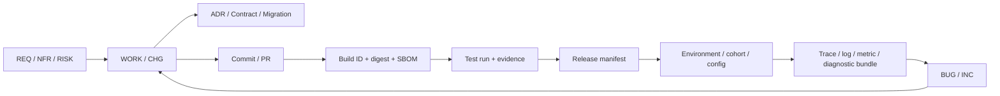
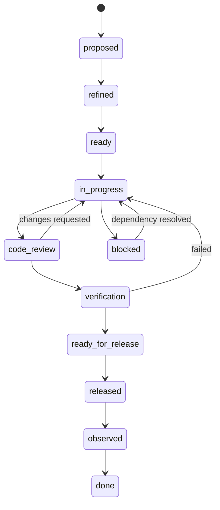

# 知识树 Agent：全生命周期开发、测试、发布与运维总纲

> **文件标识：`!!! 开发运维总纲 / Engineering & Operations Playbook`**  
> **版本：0.1（实施前流程基线）**  
> **日期：2026-08-13**  
> **状态：流程已规划，工具链、CI、监控和发布能力尚未部署**  
> **上游基线：`!!!_【工程框架指导】知识树Agent_总体架构技术基线_v0.1.md`**  
> **LLM 兼容基线：`!!!_【多LLM兼容基线】知识树Agent_DeepSeek优先适配与配置_v0.1.md`**  
> **适用范围：需求、设计、开发、测试、发布、运营、更新、缺陷修复、事故响应和退役**

> **2026-08-13 个人项目治理增补**：AI 学科复核与 AI QA 可由确定性 harness 编排的职责隔离子 Agent承担。它们提供 machine attestation，不冒充真人签字；同一模型/Provider 属于相关性复核，必须披露。个人 workspace owner 负责最终范围与残余风险接受，安全不变量不可豁免。详细政策见 `docs/PRODUCT_REQUIREMENTS.md` 和 ADR-0015。

---

## 0. 目标与使用规则

本总纲的目标不是增加文档负担，而是保证未来出现问题时能够回答：

1. 用户遇到的到底是哪一个版本、构建、配置和数据 schema；
2. 哪项需求、风险或缺陷触发了这次改动；
3. 哪个提交、依赖、模型、prompt、迁移和开关进入了发布；
4. 哪些自动与人工测试证明它可以发布；
5. 运行中的请求、任务、模型调用和图 revision 在哪里失败；
6. 如何止损、回滚、恢复、验证并防止复发；
7. 谁批准了风险，哪些结论有证据，哪些仍是未知。

### 0.1 当前事实

截至 2026-08-13：

- 当前目录不是 Git 仓库；
- 尚无产品代码、CI/CD、测试执行、监控、备份或正式发布；
- 已有 Proposal、总体架构技术基线和本流程基线；
- 因此本文中的监控阈值、响应时限和容量值均属于“工程初值”，不是已部署能力。

### 0.2 强制措辞

- **必须**：不满足则不得进入下一门或不得发布；
- **应当**：原则上执行，偏离时必须记录理由和风险接受人；
- **可以**：按阶段和成本选择；
- **工程初值**：必须通过测试或运营数据校准。

### 0.3 三条底线

1. 不把计划写成完成，不把一次成功演示写成稳定能力；
2. 不用聊天记录、个人记忆或口头约定替代工程事实源；
3. 不允许开发者仅凭“我本地测试过”批准自己的生产发布。

---

## 1. 文档体系与唯一事实源

所有执行文件放在 `docs/`；根目录的两份 `!!!` 文件分别是架构总纲和流程总纲。

| 文件/目录 | 唯一职责 | 更新触发 | 不应存放 |
|---|---|---|---|
| `docs/ENGINEERING_PLAN.md` | 当前阶段、工作项、依赖、状态和阶段门 | 计划/状态变化 | 详细调试过程 |
| `docs/DEVELOPMENT_LOG.md` | 按时间记录技术变化、接口版本、验证和遗留项 | 每次技术变更 | 未筛选的运行日志 |
| `docs/OPS_LOG.md` | 环境、发布、现存运行问题、缓解和接手提示 | 运维/发布/事故变化 | 产品需求草案 |
| `docs/BUG_REGISTER.md` | 全部缺陷的索引、状态、严重度和修复版本 | Bug 全生命周期 | 大段原始日志 |
| `docs/RISK_REGISTER.md` | 尚未发生但可能影响目标的风险 | 风险变化/阶段门 | 已发生事故的完整复盘 |
| `docs/TRACEABILITY_MATRIX.md` | 需求/风险到实现、测试、版本和证据的映射 | 工作项/发布变化 | 重复测试正文 |
| `docs/CHANGELOG.md` | 用户可见的版本变化 | 正式发布 | 内部敏感信息 |
| `docs/USER_MANUAL.md` | 用户实际可操作行为、诊断和数据说明 | 用户行为变化 | 未上线功能 |
| `docs/adr/` | 重要且长期的架构决策 | 决策接受/替代 | 每次小改动 |
| `docs/test-reports/` | 一次测试执行的不可变报告与证据索引 | 每次正式测试 | 可被覆盖的“latest”报告 |
| `docs/releases/` | 每个版本的 manifest、清单、签字和回滚记录 | 每个候选/正式版本 | 其他版本证据 |
| `docs/incidents/` | 事故时间线、根因、影响、恢复和行动项 | SEV 事故 | 普通 Bug 索引 |
| `docs/runbooks/` | 当前有效的可执行运维/排障步骤 | 系统/流程变化 | 历史事故叙事 |
| `docs/templates/` | 可复制的标准模板 | 模板字段变化 | 已执行记录 |

`docs/README.md` 是文档地图。寄存器只保留摘要和链接，详细证据放到对应报告目录，避免一份 Markdown 无限膨胀。

### 1.1 文档状态

每份基线/报告头部至少包含：

```text
document_id / version / status / owner_role
created_at / updated_at / approved_by
scope / related_ids / supersedes
```

状态统一为：`draft`、`in_review`、`approved`、`superseded`、`archived`。测试报告和发布 manifest 一旦签字不得原位改写；更正时创建新版本并链接旧版本。

---

## 2. 统一标识与端到端追溯链

### 2.1 ID 规则

| 类型 | 格式 | 示例 |
|---|---|---|
| 产品需求 | `REQ-YYYY-NNN` | `REQ-2026-001` |
| 非功能需求 | `NFR-YYYY-NNN` | `NFR-2026-003` |
| 风险 | `RISK-YYYY-NNN` | `RISK-2026-002` |
| 架构决策 | `ADR-NNNN` | `ADR-0004` |
| 工作项 | `WORK-YYYY-NNN` | `WORK-2026-014` |
| 缺陷 | `BUG-YYYY-NNN` | `BUG-2026-021` |
| 变更申请 | `CHG-YYYY-NNN` | `CHG-2026-009` |
| 测试用例 | `TC-AREA-NNN` | `TC-ANCHOR-017` |
| 测试执行 | `TR-YYYYMMDD-NNN` | `TR-20260813-001` |
| 发布 | `REL-X.Y.Z[-pre]` | `REL-0.3.0-rc.1` |
| 事故 | `INC-YYYY-NNN` | `INC-2026-004` |
| Runbook | `RB-AREA-NNN` | `RB-DB-002` |

编号只表示身份，不表示优先级；删除的编号不复用。

### 2.2 必须可追溯的链



任一生产构建必须能反查 source commit，任一已关闭 Bug 必须能反查失败测试、修复提交、回归测试和首次包含修复的版本。

### 2.3 运行关联键

沿用架构基线，并扩展为：

```text
installation_id (隐私保护、可重置)
session_id
correlation_id
request_id
job_id -> stage_run_id -> model_run_id
course_id -> graph_revision_id
release_version -> build_id -> git_commit -> config_fingerprint
```

用户反馈最少需要：应用版本、错误码、发生时间和 correlation/job ID 中任一个。诊断包负责补齐其余信息。

---

## 3. 角色、职责与签字分离

| 角色 | 主要责任 | 必须签字的事项 |
|---|---|---|
| 产品负责人 | 需求、范围、用户影响、优先级、风险收益 | 需求接受、用户行为、业务风险接受 |
| 总工程师/技术负责人 | 架构、接口、数据迁移、技术风险 | 架构/接口/迁移基线和技术可发布性 |
| 实现者 | 设计、代码、单元测试、自检、证据整理 | 不得单独批准自己的发布 |
| QA | 测试策略、独立验证、缺陷分级、回归 | 测试证据与 GO/NO-GO |
| 运维/SRE | 环境、配置、监控、备份、部署、回滚、事件响应 | 运行准备度和部署结果 |
| 安全/隐私 | 威胁、秘密、日志、依赖、数据处理 | 高风险安全与隐私变更 |
| 发布负责人 | 汇总签字、冻结范围、执行版本门 | 最终发布/中止决定 |
| AI 学科复核 Agent | 查证学科事实、关系与锚点，记录证据/反证/不确定性 | 只生成 subject machine attestation |
| AI QA Agent | 独立重算机械门、主动证伪、检查证据/安全/可重放性 | 只生成 QA machine attestation |
| Harness policy engine | 校验权限、provenance、隔离和状态机 | 确定性计算机器审查状态，无业务风险接受权 |

单人阶段可以一人承担多个角色，但必须：

- 分时执行“实现”和“验收”，使用书面清单重新审视；
- 高风险发布至少找一名独立复核者；
- 不能删掉 QA/运维签字字段，只能标记 `same_person_due_to_team_size` 并记录风险。

个人 AI-only 项目使用子 Agent 时：

- 每个角色必须使用不同 run、role prompt、context manifest 和冻结 artifact；
- QA 不得读取学科 Agent 的隐藏推理或共享可变会话；
- 相同模型或 Provider 必须记录 `correlated_review`，不能宣称真人或强组织独立；
- Agent 不得自授工具、写库、改锁、执行 GraphPatch、改审批或接受风险；
- workspace owner 的显式风险接受只适用于可披露的残余风险，不能绕过输入漂移、越权、伪证据、未解决分歧、秘密泄漏或审计缺失。

---

## 4. 项目阶段与顺序

一次只推进一个主阶段。跨阶段想法进入 backlog，不提前混入实现。

| 阶段 | 目标 | 入口门 | 出口证据 |
|---|---|---|---|
| -1 架构准备 | 冻结范围、模型、流程与证据形式 | Proposal 存在 | 架构基线、流程基线、待决问题 |
| 0 技术尖峰 | 用实测击穿锚点、GraphPatch、AI、sidecar 等高风险 | 金标和测试环境确定 | 尖峰报告、基准、GO/NO-GO |
| 1 手工 MVP | 无 AI 也能可靠导入、编辑、定位、撤销和恢复 | 核心 contract 冻结 | E2E、备份恢复、安装包验证 |
| 2 AI 构图/RAG | 以草案和证据接入 AI | 手工闭环稳定 | AI eval、锁保护、成本/降级证据 |
| 3 Beta 加固 | 网络研究、多格式、安全和可运营性 | SLO/诊断/发布能力可用 | 真实用户、故障注入、灰度/回滚 |
| 4 正式运营 | 稳定渠道、支持、响应、容量和生命周期 | Beta 指标达到门槛 | 版本节奏、SLO、演练和复盘闭环 |

阶段状态只能是：`未开始`、`进行中`、`受阻`、`待验收`、`完成`。

### 4.1 阶段入口检查

- 上一阶段出口证据齐全；
- 当前范围、非目标、依赖和负责人明确；
- 数据/样本有授权；
- 关键接口和安全不变量冻结；
- 验收指标与失败后的降级路径写明；
- 环境、工具、时间和预算可用；
- 阻断风险已有处置。

### 4.2 阶段出口检查

- 工作项状态与实际一致；
- 验收测试可重跑，原始证据仍在；
- 所有 P0/P1 缺陷关闭或书面接受；
- 性能、安全、恢复和可观测性没有被功能测试替代；
- 开发日志、运维日志、用户手册、风险、追溯矩阵已同步；
- 下一阶段入口条件明确；
- QA 给出 `GO`、`CONDITIONAL GO` 或 `NO-GO`。

---

## 5. 从需求到完成的标准工作流



### 5.1 工作项最少字段

```text
WORK ID / title / type / owner / reviewers
related REQ-NFR-RISK-BUG-ADR
scope / out_of_scope / user impact
dependencies / assumptions / affected modules
data or schema impact / security and privacy impact
observability impact / rollout and rollback
acceptance criteria / test plan / evidence required
documentation updates / estimated risk / status
```

### 5.2 Definition of Ready

进入开发前必须满足：

- 能说明用户或工程问题，不是只有“做某技术”；
- 范围与非范围明确；
- 验收标准可测试；
- 关键交互、错误和边界条件已定义；
- 数据迁移、遥测、隐私和回滚已判断；
- 上游依赖可用；
- 无未解决的阻断型设计歧义。

### 5.3 实现过程

1. 从工作项创建短生命周期分支；
2. 先写/更新失败测试或最小复现；
3. 实现最小范围；
4. 增加结构化日志、metrics/span 和稳定错误码；
5. 本地执行静态、单元、属性和相关集成测试；
6. 更新 contract/migration/prompt/ADR 和文档；
7. 提交 PR，附验证证据、风险和回滚；
8. 代码审查后由 CI 与 QA 验证；
9. 合入后进入候选版本，不等于已发布；
10. 发布后观察稳定窗口，才能关闭工作项。

### 5.4 Definition of Done

- 验收标准全部有证据；
- 正常、边界、错误、恢复路径均测试；
- 可观测性足以判断成功/失败和定位边界；
- 迁移有前向、兼容和恢复测试；
- 不包含秘密、调试后门或无上限队列；
- 用户行为和支持说明更新；
- 追溯矩阵完整；
- 发布后观察未出现相关回归；
- 未完成项明确转为新 ID，不藏在评论中。

---

## 6. Git、分支、提交和版本策略

### 6.1 建议：主干开发

- `main` 始终可构建，受保护，禁止直接 push；
- `feature/WORK-...-short-name`：功能/技术工作项；
- `fix/BUG-...-short-name`：普通修复；
- `hotfix/BUG-...-short-name`：从生产 tag 创建的紧急修复；
- `release/0.y`：只在候选稳定期需要，禁止继续加功能；
- 分支应在数日内合回，长期探索用 feature flag 或独立 spike 分支。

没有明确远端归属、认证和公开策略前，只完成本地版本门，不擅自创建公开仓库。

### 6.2 Commit

采用 Conventional Commits，并带工作项：

```text
feat(graph): add patch cycle diagnostics

Refs: WORK-2026-014, NFR-2026-003
Test: TC-GRAPH-012, TC-GRAPH-019
```

提交应原子、可评审，不把格式化、无关重构和功能混在一起。禁止提交 API key、真实用户资料、数据库、未脱敏日志和大体积模型。

### 6.3 版本

应用遵循 SemVer：`MAJOR.MINOR.PATCH[-prerelease]+build`。0.x 阶段仍须明确兼容性。已发布 artifact 不得原位替换；任何变化发布新版本。[SemVer 2.0.0](https://semver.org/)

- Patch：兼容 Bug 修复；
- Minor：向后兼容功能；
- Major：公开 contract 或数据行为不兼容；
- `alpha`：内部验证；`beta`：受控用户；`rc`：只允许阻断修复；
- build metadata 含 CI run/短 commit，但 artifact 身份最终用 SHA-256。

独立版本必须记录：

```text
app_version / desktop_version / sidecar_version
database_schema_version / API_contract_version
GraphPatch_schema_version / Anchor_schema_version
parser_version / prompt_version / model_policy_version
```

### 6.4 构建来源

每个候选/正式 artifact 必须有：commit、builder、时间、依赖锁文件、构建参数、SHA-256、SBOM 和来源证明。SLSA 强调一致构建过程及能够用摘要明确识别产物的 provenance；本项目先以 L1 形态建立证据，再逐步使用托管、签名构建提升强度。[SLSA Build Requirements](https://slsa.dev/spec/v1.2/build-requirements)

---

## 7. 代码评审和变更分类

### 7.1 评审检查顺序

1. 是否满足工作项而没有范围外扩；
2. 数据丢失、权限绕过、锁定覆盖、陈旧任务提交等高风险；
3. 并发、幂等、重试、超时、取消和队列上限；
4. contract、迁移和兼容性；
5. 错误码、日志、trace、metrics 和诊断能力；
6. 测试是否能证明修复且不会误报；
7. 性能、成本、隐私和依赖；
8. 可读性和维护性。

### 7.2 必须双重评审的变更

- 数据库 migration、删除/清理逻辑；
- GraphPatch/Anchor/公开 API schema；
- 文件权限、密钥、认证、更新与签名；
- Prompt 工具权限和自动接受策略；
- 备份、恢复、回滚；
- 构建/发布流水线；
- 遥测内容、用户数据上传和保留策略。

### 7.3 变更类别

| 类别 | 示例 | 流程 |
|---|---|---|
| 标准 | 文档、低风险内部重构 | 正常 PR + 自动测试 |
| 正常 | 功能、普通 Bug、依赖升级 | CHG/WORK + 完整验证 + 灰度 |
| 高风险 | schema、数据清理、安全、自动更新 | 维护窗口、独立签字、演练、强回滚 |
| 紧急 | 正在造成严重用户影响/安全风险 | 最小修复、应急批准、随后补全证据和复盘 |

紧急流程允许缩短前置步骤，不允许省略事后测试、追溯、事故记录和复盘。

---

## 8. CI/CD 流水线

### 8.1 PR 快速门（目标 ≤15 分钟，工程初值）

```text
secret scan
format/lint
Python/TypeScript/Rust type and compile checks
unit + property tests
contract/schema compatibility
LLM config schema + provider fixture contracts（禁止 live API）
SQLite migration up/down/compat smoke
changed-module integration tests
license policy and dependency vulnerability scan
```

任何必需检查失败不得合并。Flaky test 不能简单重跑到绿；必须登记 Bug、量化波动，并设修复期限。

### 8.2 Main 合入门

- 全量单元/属性/契约；
- 关键集成：SQLite、sidecar、Docling fixtures、PDF viewer fixtures；
- Tauri/Web/API 关键 E2E；
- 安全测试：路径、上传、SSRF、Prompt Injection 基线；
- 生成不可发布的内部构建、digest、SBOM 和测试摘要。

### 8.3 Nightly

- 全 corpus 解析回归；
- AI 金标 eval（固定 provider snapshot 或 replay fixture）；
- DeepSeek 脱敏 fixture 的 JSON/tool/stream/错误映射回归；真实 API 只在隔离的 opt-in live job 中运行；
- fuzz/property 长跑；
- 500 节点、50k segment 性能与内存；
- 依赖/许可证/SBOM；
- 数据库完整备份与自动恢复；
- Windows 干净环境安装/卸载；
- 失败证据无论成功与否都保留。

### 8.4 Release Candidate 门

- 从干净、受控 builder 构建并签名；
- 全量回归与风险驱动测试；
- 新装、覆盖升级、旧版数据迁移、降级阻止/兼容；
- sidecar 崩溃、断网、磁盘满、Provider 400/401/402/422/429/5xx、断流、应用重启故障注入；
- 备份恢复和回滚演练；
- 用户手册、CHANGELOG、已知问题；
- 发布 manifest、artifact digest、SBOM、provenance；
- 总工程师、QA、运维和发布负责人签字。

### 8.5 生产发布

```text
RC signed -> internal/dogfood -> beta cohort -> 5% -> 25% -> 100%
```

比例和观察期是工程初值。每一阶段必须有停止条件；没有隐私合规的运营遥测前，使用明确的 beta/stable 渠道和人工反馈，不暗中收集。

---

## 9. 测试策略

### 9.1 测试层次

| 层 | 目的 | 关键对象 |
|---|---|---|
| 静态 | 在运行前发现问题 | lint、type、依赖、秘密、schema |
| 单元 | 证明纯逻辑 | GraphPatch、DAG、Anchor、job 状态机 |
| 属性/fuzz | 探索组合和边界 | 任意 patch、selector、解析输入、API |
| 组件 | 证明 adapter | SQLite、Provider、Docling、PDF.js |
| 契约 | 防接口漂移 | OpenAPI、JSON Schema、SSE、错误码 |
| 集成 | 证明模块协作 | UI/API/Worker/DB/objects |
| E2E | 证明用户任务 | 导入→草案→审核→定位→恢复 |
| AI eval | 证明概率能力 | 抽取、关系、检索、引用、命令解释 |
| 安全 | 证明边界 | 文件、路径、SSRF、注入、越权、秘密 |
| 性能/容量 | 证明预算 | 节点、segments、文件、内存、token |
| 恢复/韧性 | 证明失败不破坏数据 | 崩溃、断网、磁盘、迁移、回滚 |
| 可用性 | 证明用户能完成 | 真实用户任务和误操作恢复 |

### 9.2 每个功能的最低测试包

- happy path；
- 输入边界、空值、超长、重复和乱序；
- 权限与 workspace 隔离；
- 超时、重试、取消和恢复；
- 幂等与并发；
- 旧版本/旧数据兼容；
- 日志/错误码/trace 是否可定位；
- 用户可撤销或安全失败；
- 资源和成本上限。

### 9.3 AI 测试

AI 变更必须冻结：corpus、标注版本、provider/model、prompt、schema、sampling、seed（若支持）、预算和运行环境。报告：

- Precision/Recall/F1 和误合并率；
- 关系方向、DAG 冲突和 calibration；
- Recall@K、MRR/nDCG、引用覆盖和 groundedness；
- schema failure、拒绝、超时、重试、token、成本和 p50/p95/p99；
- 与上一批准基线的差异及统计/样本说明。

模型响应易变时，单元/集成使用录制且脱敏的 fixture；正式 eval 使用真实 Provider，二者不得混为一谈。

多 LLM 追加门：

- 每个启用的 Provider 必须分别覆盖消息映射、JSON/schema、stream、tool、usage、错误映射、取消、预算和脱敏；
- DeepSeek 必测 thinking + tool call 的 `reasoning_content` 回传，但测试与诊断证据不得保存其正文；
- `RUN_LIVE_LLM_TESTS=1` 和受控 secret 同时存在才可跑真实 smoke；普通 PR、fork 和外部贡献默认禁止真实调用；
- 新 Provider/模型不能仅凭同一个 prompt “能回答”就通过，必须运行同一金标、记录 capability snapshot，并与当前批准 deployment 比较质量、成本和 p95；
- 回退测试必须证明不会复用不同协议的 partial output/opaque reasoning，不会重复执行有副作用工具，也不会绕过 GraphPatch 审核。

### 9.4 缺陷回归原则

每个 P0–P2 Bug 必须先有能失败的自动测试或明确说明为什么只能人工验证。修复后：

1. 原始最小复现通过；
2. 邻近边界测试通过；
3. 全量相关回归通过；
4. 失败路径的遥测能区分修复前后；
5. 发布后观察窗口无复发。

---

## 10. 测试数据、环境与证据

### 10.1 环境

| 环境 | 用途 | 数据 | 发布权限 |
|---|---|---|---|
| local-dev | 开发与快速测试 | 合成/许可 fixture | 开发者 |
| CI | 可复现自动验证 | 固定 fixture | 流水线 |
| test | 集成/QA | 脱敏或合成 | QA/运维 |
| staging | 生产同构候选 | 禁止随意复制真实用户数据 | 发布/运维 |
| production | 用户运行 | 真实数据，最小权限 | 受控发布 |

配置必须声明式、版本化。环境差异进入 `docs/OPS_LOG.md`，不靠口头说明。

### 10.2 证据目录

```text
evidence/<TR-ID>/
  manifest.json
  environment.json
  commands.txt
  junit.xml
  coverage.xml
  metrics.json
  logs/                 # 脱敏
  screenshots/
  traces/
  analysis.ipynb|py
  checksums.sha256
```

正式报告只引用 evidence manifest。失败证据不得删改；若包含敏感资料，存受控位置并在仓库只保留引用、hash 和访问规则。

### 10.3 可重现性

报告必须记录 OS、CPU/RAM、依赖锁、应用/build、数据库 schema、配置 fingerprint、测试数据版本、模型/prompt/schema、命令、随机 seed、开始/结束时间和时区。

---

## 11. 可观测性设计

### 11.1 原则

- logs 解释离散事件，traces 解释跨边界路径，metrics 解释趋势和告警，profiles 解释资源热点；
- 同一概念使用统一字段名；优先采用 OpenTelemetry semantic conventions；其价值在于跨语言和平台统一关联 traces、metrics、logs 与 resources。[OpenTelemetry Semantic Conventions](https://opentelemetry.io/docs/specs/semconv/)
- 先定义要回答的排障问题，再添加遥测；
- 默认不记录文档全文、prompt 全文、API key、本地完整路径和个人身份；
- 日志系统故障不得让核心业务崩溃，也不得无限占满磁盘。

### 11.2 结构化日志最少字段

```json
{
  "timestamp": "2026-08-13T08:30:00.123Z",
  "severity": "ERROR",
  "event_name": "ingestion.stage.failed",
  "service.name": "knowledge-tree-worker",
  "service.version": "0.2.0",
  "deployment.environment.name": "local",
  "build.id": "...",
  "git.commit": "...",
  "correlation_id": "...",
  "job_id": "...",
  "stage_run_id": "...",
  "workspace_id_hash": "...",
  "resource_id": "...",
  "model_run_id": "...",
  "provider": "deepseek",
  "protocol": "openai_chat_completions",
  "deployment_alias": "deepseek/quality",
  "model_id": "deepseek-v4-pro",
  "model_policy_version": 1,
  "capability_snapshot": "sha256:...",
  "attempt": 2,
  "fallback_from": null,
  "error.code": "provider_timeout",
  "error.type": "ProviderIdleTimeout",
  "retryable": true,
  "duration_ms": 30001,
  "result": "failure"
}
```

OWASP 建议应用日志至少能说明 when、where、who、what，并记录动作、对象、结果和原因；本项目采用脱敏 ID 实现，不把敏感原文塞入日志。[OWASP Logging Cheat Sheet](https://cheatsheetseries.owasp.org/cheatsheets/Logging_Cheat_Sheet.html)

### 11.3 必须记录的领域事件

- 应用/sidecar 启动、退出、版本不兼容；
- resource 注册、校验、缺失、版本变化；
- job 排队、领 lease、阶段开始/结束、重试、取消、lease 丢失；
- Provider 请求摘要、protocol/deployment/model/policy/capability、attempt/fallback、限流、schema failure、成本，不记录秘密、原文或 reasoning 内容；
- GraphPatch validate/apply/reject/conflict、锁拒绝、DAG 拒绝；
- anchor valid/recovered/ambiguous/drifted；
- migration 开始/结束/失败、备份与恢复；
- 配置、feature flag、权限和密钥轮换；
- 更新检查、下载、签名校验、安装、回滚；
- 导入、导出和彻底清除等高价值动作。

### 11.4 日志等级

- `ERROR`：操作失败或数据风险，需要处置；
- `WARN`：降级、重试、接近阈值、可恢复异常；
- `INFO`：生命周期和审计事件；
- `DEBUG/TRACE`：仅诊断开启，有时间限制和明显隐私提示。

不得用 ERROR 记录正常分支，也不得吞异常只写模糊的“失败”。

### 11.5 Trace 边界

关键 spans：

```text
ui.action
api.request
resource.register
job.enqueue / job.run
ingestion.<stage>
parser.convert / ocr.run
provider.generate / provider.embed / web.search
graph_patch.validate / graph_patch.commit
db.transaction / object.write
anchor.resolve / viewer.navigate
backup.create / restore.verify / migration.run
```

span 必须记录状态和稳定 error code；大文本和向量只记录大小/hash，不记录内容。

### 11.6 Metrics 与 SLI

本地产品初始 SLI：

- 启动成功率、崩溃率；
- 导入成功率和各 stage 失败率；
- job queue age、retry、stuck job；
- GraphPatch 成功/冲突/锁拒绝；
- anchor 成功/ambiguous/drifted；
- 检索和 viewer latency；
- 按 provider/protocol/deployment 聚合的 schema failure、400/401/402/422/429/5xx、断流、fallback、熔断、token 和成本；
- DB/对象/cache 占用、备份年龄、恢复验证；
- 更新成功/失败/回滚。

云端再增加 API availability、error ratio、p95/p99、租户隔离、队列和容量 SLO。正式 SLO 必须在 Beta 数据后批准。

### 11.7 Cardinality

用户、resource、job、trace 等高基数字段只进入 logs/traces，不作为 metrics label。Metrics label 限 service、version、environment、stage、result、error_code 等有限集合。

---

## 12. 用户诊断包与隐私

用户应能在设置页执行“导出诊断包”，预览内容后主动保存或发送。

### 12.1 默认包含

```text
diagnostic_manifest.json
app/build/schema/config fingerprints
OS/CPU/RAM/disk free（不含设备序列号）
health checks and DB integrity summary
selected time-window redacted logs
job/stage timeline
recent stable error codes and stack signatures
feature flag states
update/backup status
checksums.sha256
```

### 12.2 默认不包含

- API key、token、cookie；
- 原始课件、数据库、embedding；
- prompt/response 全文；
- 本地完整用户名和路径；
- 网络资料全文；
- 未经确认的截图。

路径转为 basename + hash；quote 仅在用户显式选择时加入。诊断包生成过程本身写审计事件，临时文件在成功/失败后按策略清理。

### 12.3 支持信息

UI 错误页显示：稳定错误码、发生时间、可复制 correlation/job ID、重试/恢复建议和“导出诊断包”，不直接展示内部 stack trace。

---

## 13. Bug 生命周期和定位方法

### 13.1 Bug 状态

```text
new -> triaged -> reproducing -> confirmed -> fixing
fixing -> code_review -> verification -> ready_for_release
ready_for_release -> released -> monitoring -> closed
new/triaged -> duplicate | not_a_bug | cannot_reproduce | deferred
verification -> reopened
```

`cannot_reproduce` 不是“关掉算了”，必须记录已尝试环境、缺失证据和重新开启条件。

### 13.2 严重度

| 严重度 | 定义 | 例子 | 发布影响 |
|---|---|---|---|
| P0 | 大范围数据丢失/泄露、无法安全使用、供应链/签名失陷 | 锁定内容被批量覆盖且不可恢复 | 立即停止发布/更新，进入事故流程 |
| P1 | 核心流程不可用、无合理绕过、可能破坏数据 | 大量用户无法导入或打开已有库 | 阻断发布，优先 hotfix |
| P2 | 重要功能错误但有绕过，局部影响 | PPTX 页定位错误、特定文件失败 | 通常阻断相关功能发布 |
| P3 | 一般错误或体验问题 | 文案、布局小错 | 正常排期 |
| P4 | 改进建议 | 更好的提示/诊断 | backlog |

严重度是影响，优先级还考虑发生率、可检测性、用户数、绕过成本和修复风险。

### 13.3 Bug 最少字段

```text
BUG ID / title / severity / priority / status / owner
first_seen_version / affected_versions / environment
reported_at / reporter / frequency / user impact
preconditions / exact steps / expected / actual
error_code / correlation_id / job_id / revision_id
diagnostic bundle or evidence refs
suspected first bad version / regression yes-no-unknown
workaround / data risk / security-privacy assessment
root cause category / fix commit / test IDs / fixed_in_version
release observation / closure evidence
```

### 13.4 定位顺序：先找“第一个坏掉的边界”

1. **保护现场**：复制诊断包、时间、版本、ID；不要先清缓存/重装；
2. **判断影响**：是否数据/安全风险，是否要停更、禁用开关、隔离资源；
3. **验证版本身份**：app/build/schema/config fingerprint/provider/protocol/deployment/model policy/capability snapshot/prompt；
4. **沿 trace 查第一处 error**，不要只看最终 UI 报错；
5. **检查 job/stage 状态机**：queued、lease、retry、artifact、commit；
6. **检查数据不变量**：DB integrity、DAG、锁、revision、hash；
7. **最小化输入**：文件页、patch、query、provider fixture；
8. **比较好/坏环境和版本**：配置 fingerprint、依赖、模型和 migration；
9. **必要时 git bisect**，用稳定自动复现脚本找 first bad commit；
10. **形成单一可证伪假设**，增加临时受控诊断；
11. **写失败测试并修复根因**，不只吞异常或延长超时；
12. **验证修复、相邻回归、升级/回滚和运营指标**。

### 13.5 症状路由表

| 症状 | 首查 ID/证据 | 首查边界 | 关键不变量 |
|---|---|---|---|
| 应用打不开 | build、startup log、sidecar health | Tauri→sidecar→DB | 版本兼容、端口/token、migration |
| 导入失败 | resource/job/stage | receive→parse→object | hash、格式、磁盘、parser timeout |
| 任务卡住 | job/stage/lease | queue→Worker | lease 续约、queue age、取消 |
| AI 无输出/格式错 | model_run/policy/config/fixture | router→capability→protocol→vendor→schema | secret 状态、预算、thinking、reasoning replay、HTTP、断流、schema、版本 |
| AI 回退后结果异常/工具重复 | model_run/attempt/fallback/tool_call_id | retry→fallback→tool boundary | 只允许批准错误、fresh run、partial 不复用、副作用不重放 |
| 图关系错误 | graph revision/model_run/evidence | extract→validate→review | evidence、DAG、review_state |
| 锁定项被改 | patch/revision/actor | rebase→validator→commit | lock 必须在事务内复核 |
| 点击来源错 | anchor/resource version | resolver→viewer | hash、selector、margin、坐标 |
| 搜索质量下降 | query/eval/model | FTS/vector→RRF→rerank | 模型维度、索引版本、过滤 |
| 数据丢失 | revision/backup/purge audit | DB/object/migration | tombstone、manifest、恢复点 |
| 更新失败 | release/build/update event | download→signature→migration | digest、签名、磁盘、兼容矩阵 |

### 13.6 根因分类

`requirements`、`design`、`implementation`、`concurrency`、`data_migration`、`configuration`、`dependency`、`provider`、`test_gap`、`observability_gap`、`release_process`、`security`、`capacity`、`user_environment`。只能在有证据后选择，不把“人为错误”当最终根因。

---

## 14. 运行问题与事故响应

### 14.1 何时从 Bug 升级为事故

出现以下任一情况创建 `INC`：

- 真实用户数据丢失、泄露或错误覆盖；
- 签名、更新、密钥或供应链异常；
- 大面积核心流程不可用；
- 需要停止发布、撤回版本或发布紧急公告；
- 影响超出单个普通工单，需跨角色协调。

### 14.2 事故严重度与响应初值

| 级别 | 影响 | 初次响应目标 | 状态更新 |
|---|---|---:|---:|
| SEV-0 | 安全/隐私或不可逆大规模数据风险 | 15 分钟 | 30 分钟 |
| SEV-1 | 核心功能大面积不可用/高数据风险 | 30 分钟 | 60 分钟 |
| SEV-2 | 部分用户重要功能受损 | 4 小时 | 每工作日 |
| SEV-3 | 低影响运行问题 | 1 工作日 | 按计划 |

这些是进入正式运营前要校准的工程初值，不代表当前已有 7×24 值守。

### 14.3 事故角色

- Incident Commander：决策和协调，不亲自陷入每个技术细节；
- Operations Lead：止损、发布、回滚、恢复；
- Technical Lead：定位和修复；
- Communications：用户/内部状态；
- Scribe：时间线、命令、证据和决定。

小团队可兼任，但必须明确当前帽子。

### 14.4 响应顺序

```text
detect -> declare -> contain -> preserve evidence -> diagnose
-> mitigate/rollback -> verify data and service -> communicate
-> monitor -> resolve -> postmortem -> preventive actions
```

止损优先于根因完美：暂停自动更新、关闭 feature flag、阻止危险写入、切换只读或 Provider 降级。但任何临时动作都必须记录操作者、时间、范围和撤销条件。

### 14.5 复盘

SEV-0/1 在恢复后 5 个工作日内完成复盘（工程初值）。复盘包含影响、检测、时间线、根因、促成因素、哪些保护有效/失效、恢复证据、行动项、owner、期限和验证方法。行动项必须进入 `WORK`，不能停留在“加强注意”。

---

## 15. Runbook 体系

Runbook 必须是值班人员按步骤可执行的当前程序，而不是原理文章。每份包括：触发条件、风险、前置权限、诊断命令/界面、决策树、缓解、恢复、验证、回滚、升级条件和证据位置。

正式 Beta 前至少具备：

```text
RB-APP-001  应用/sidecar 启动失败
RB-JOB-001  任务卡住、lease 丢失和安全重试
RB-DB-001   SQLite integrity、WAL 和空间异常
RB-DB-002   备份创建与恢复验证
RB-MIG-001  migration 失败与恢复
RB-PROV-001 LLM Provider/DeepSeek 配置、认证、超时、限流、协议和回退故障
RB-ANCH-001 锚点漂移与误跳
RB-REL-001  候选版本发布、暂停和回滚
RB-UPD-001  桌面更新失败
RB-SEC-001  密钥疑似泄露
RB-DATA-001 用户数据导出和彻底清除
RB-DIAG-001 用户诊断包分析
```

每季度或每个大版本至少演练高风险 Runbook；演练也产生测试报告和改进行动。

---

## 16. 发布、灰度、回滚与更新

### 16.1 发布 manifest

每个候选和正式版本记录：

```text
release/version/channel/status
source commit/tag/build/provenance/digests/SBOM/signature
desktop/sidecar/API/DB/contract/prompt/model policy versions
included WORK/BUG/CHG/ADR
migrations/config/feature flags
test reports and unresolved risks
install/upgrade/rollback compatibility matrix
rollout cohorts, stop conditions and observer
approvals, timestamps and final result
```

### 16.2 发布前备份与迁移

采用 expand → migrate/backfill → switch → contract：

1. 新代码先兼容旧 schema；
2. 创建并验证备份；
3. 执行可恢复 migration；
4. 校验行数/hash/DAG/revision/object manifest；
5. 新旧读路径观察；
6. 跨过 rollback 窗口后才移除旧字段。

禁止把“数据库 down migration 能运行”等同于“用户数据可安全降级”。如果旧二进制不兼容新数据，更新失败时应恢复备份或前向修复，而不是盲目启动旧版。

### 16.3 停止条件

灰度任一阶段出现以下情况立即暂停：

- 新增 P0/P1；
- 数据完整性、锁保护、锚点误跳异常；
- 崩溃/启动/导入失败率超过批准阈值；
- migration、签名、更新或恢复异常；
- 诊断证据不足，无法确认影响边界；
- 成本或 Provider 错误超预算。

### 16.4 回滚验证

- artifact digest 和签名正确；
- config/flag 恢复；
- DB schema/data 与目标版本兼容；
- in-flight job 不会提交旧结果；
- 核心 smoke 和数据完整性通过；
- 用户影响和已知限制已沟通；
- 回滚本身写入发布和运维日志。

### 16.5 Hotfix

从生产 tag 创建，限制为最小修复；禁止夹带重构和新功能。必须包含复现测试、影响评估、构建来源、最小回归、回滚和发布后观察。合回 main，防止修复只存在于热修分支。

---

## 17. 配置、Feature Flag、依赖和秘密

### 17.1 配置

- 默认值、类型、允许范围、敏感性、热加载与否均有 schema；
- 配置变更生成 fingerprint 和审计；
- 环境差异以版本化配置表达；
- 不允许未记录的手工生产漂移；
- 诊断包只含非敏感配置或 hash。

LLM 配置另受以下约束：

- `config/llm/providers.yaml` 是协议、端点、模型 alias、能力和超时的事实源；`config/llm/model-policies.yaml` 是任务路由、预算和回退事实源；
- 两者必须 schema 校验、拒绝未知字段、生成 canonical fingerprint，并随 release manifest 记录；
- DeepSeek 是首要 Provider，但默认从 `enabled: false` 开始，只有 live smoke、金标和 `RB-PROV-001` 证据齐全后才能启用；
- Beta endpoint 需要环境、feature flag 和 policy 三重允许；不得用热修直接把生产 base URL 改到 `/beta`；
- Provider 配置无效只隔离相应 deployment；无 AI 的手工功能仍应启动并给出可行动错误。

### 17.2 Feature Flag

每个 flag 有 owner、目的、默认、范围、创建/到期版本、kill switch、依赖、遥测和清理工作项。Flag 不能绕过 schema/权限/锁/DAG 等安全不变量；到期未清理视为技术债。

### 17.3 依赖

- 锁版本和 hash；
- 自动扫描漏洞、许可证和弃用；
- 更新先进入单独 PR，附 CHANGELOG/风险；
- parser、PDF.js、Tauri、SQLite/pgvector、Provider SDK 升级必须跑专属 fixtures；
- 发布生成 SBOM；
- 高风险依赖要有替代/降级方案。

### 17.4 秘密

- 不进入仓库、日志、诊断包、截图和工单；
- 使用系统密钥链/受控 secret store；
- Provider YAML 只保存 `secret_ref`；桌面使用 keychain/Stronghold，隔离 live test 才允许 `env://DEEPSEEK_API_KEY`；
- 访问最小化、轮换、撤销和审计；
- 泄露时先撤销轮换，再查影响，不能只从 Git 历史删除。

---

## 18. 备份、恢复、容量与数据生命周期

### 18.1 备份层次

- 本地：SQLite online backup + objects manifest + checksums；
- 用户：可导出领域包；
- 云端未来：数据库 PITR + 对象版本 + 配置/secret 恢复程序；
- cache/embedding 若可重建，可不进入核心备份，但必须记录重建版本和成本。

### 18.2 恢复测试

备份不是成功生成文件，而是能恢复：

- graph revision 与锁；
- resource/object/segment 引用；
- Anchor；
- job 不重复提交；
- schema 和应用版本兼容；
- checksum 和领域不变量通过。

Nightly 做自动样本恢复；每个 RC 做一次完整恢复演练。

### 18.3 保留工程初值

| 数据 | 初值 | 说明 |
|---|---:|---|
| 本地普通日志 | 14 天或 100 MB | 两者先到，滚动；用户可调整 |
| DEBUG/TRACE | 最长 24 小时 | 显式启用并自动关闭 |
| 用户诊断包 | 用户控制 | 应用临时副本及时清理 |
| CI 常规证据 | 90 天 | release/事故证据长期保留 |
| Release manifest/SBOM/digest | 版本生命周期 + 2 年 | 正式策略后校准 |
| 云端安全审计 | 180 天 | 依法务、隐私和成本校准 |

原始用户资料的保留完全服从 workspace/产品隐私承诺，不被普通日志策略覆盖。

### 18.4 容量

监控 DB、objects、derived、cache、logs、备份和临时目录。达到 70%/85%/95%（工程初值）分别提示、限制非必要派生物、阻止高风险写入；任何自动清理必须限定 cache 或按显式保留策略执行，禁止猜测删除原件。

---

## 19. 运营值守、支持与交接

### 19.1 发布值守

每次正式发布指定 observer，观察启动、崩溃、导入、job、anchor、Provider、更新和成本。观察期结束后记录继续、暂停、回滚或扩大 cohort。

### 19.2 日常检查

- 新增 P0/P1 和安全告警；
- 发布/更新失败；
- stuck job、queue age、Provider error；
- 数据完整性和备份年龄；
- 磁盘/容量；
- 证书、签名、依赖漏洞和密钥轮换；
- 支持工单中重复症状。

本地产品若无集中遥测，通过用户主动诊断包、beta 反馈和匿名可选指标完成，不牺牲隐私换运维便利。

### 19.3 交接

接手者先读：架构基线 → 本总纲 → ENGINEERING_PLAN → DEVELOPMENT_LOG → OPS_LOG → 当前发布 manifest → open P0/P1/RISK → 关键 Runbook。不得通过聊天传秘密；权限单独授权并审计。

---

## 20. 指标评审和持续改进

每周/迭代评审：

- 交付周期、PR 等待、返工；
- 新增/关闭/重开 Bug，escaped defects；
- flaky tests、测试时长、覆盖的风险；
- AI eval 与成本漂移；
- 运行错误、MTTD、MTTR、恢复成功；
- 文档/Runbook 过期；
- 技术债和风险燃尽。

每月/版本评审：

- 发布成功、回滚、hotfix；
- SLI/SLO 与错误预算（正式运营后）；
- 备份恢复和故障演练；
- 依赖、安全、许可证和 SBOM；
- 用户支持 top symptoms 与可诊断性缺口；
- 哪些监控只制造噪声，哪些故障没有被提前发现。

指标用于改进系统，不用于鼓励隐藏缺陷或刷提交数量。

---

## 21. 当前实施顺序

本流程本身分阶段启用，避免一次搭建过重平台：

### Gate A：建仓前

- 批准架构和流程基线；
- 确定仓库归属、公开性、许可证、角色；
- 确定金标资料许可；
- 回答架构文件中的待决问题。

### Gate B：建仓第一天

- 创建 Git、保护 `main`、`.gitignore`、secret scan；
- 把 `docs/` 当前文件纳入版本管理；
- 建最小 Python/TS/Rust 工具链和锁文件；
- 创建 CI 空骨架和 artifact/evidence 约定；
- 创建第一个 WORK 和 TRACE 映射。

### Gate C：技术尖峰

- 先落错误码、结构化日志、correlation/job/stage IDs；
- 为每个 spike 保存环境、命令、原始证据和报告；
- 建 Bug、风险、ADR 和测试报告闭环；
- 不要求生产告警平台，但本地日志和诊断包格式必须先验证。
- 冻结 canonical LLM contract、能力 enum、Provider 错误码和配置 schema；
- 先完成 mock/fixture，再完成 DeepSeek JSON、stream、thinking/tool、429/5xx 与脱敏 live smoke；

### Gate D：手工 MVP

- CI 全门、安装/升级、数据库迁移、备份恢复；
- 用户诊断包；
- 最小 Runbook；
- RC/发布 manifest 和签字；
- 无这些能力不得称为可运营 Beta。

### Gate D2：DeepSeek AI 草案

- DeepSeek deployment 已通过 `TC-LLM-001..009` 与 `EVAL-LLM-001`；
- model policy 的 token/金额/延迟上限已批准，配置 fingerprint 可追溯；
- `RB-PROV-001` 已对 401/402、429、5xx、断流、schema failure 和回退演练；
- AI 仍只生成草案，锁、DAG、证据和 GraphPatch 回归全绿；
- 未满足时保持 mock/fixture，不影响手工 MVP 发布。

### Gate E：Beta/运营

- staging、签名、分渠道/灰度更新；
- OpenTelemetry backend 或等价平台；
- SLI/SLO、告警、值守、事故响应；
- 定期恢复、回滚、安全和 Runbook 演练；
- 支持与诊断包闭环。

---

## 22. 发布签字总表

### 技术负责人

- [ ] 架构/contract/schema/migration 可追溯；
- [ ] 并发、幂等、队列、锁、DAG 和数据完整性已验证；
- [ ] 未验证项和工程初值明确；
- [ ] 回滚/恢复路径成立。

### QA

- [ ] 需求/风险/缺陷到测试可追溯；
- [ ] 自动、人工、故障注入和回归证据齐全；
- [ ] 测试环境、数据、seed、模型和阈值冻结；
- [ ] 给出 GO/CONDITIONAL GO/NO-GO。

### 运维

- [ ] 配置、监控、告警和 dashboard/查询已验证；
- [ ] 备份可恢复、更新/回滚已演练；
- [ ] Runbook、observer、维护窗口和停止条件就绪；
- [ ] 已知问题有缓解和 owner。

### 安全/隐私

- [ ] 文件、路径、SSRF、Prompt Injection 和秘密测试通过；
- [ ] 日志/诊断包不泄露敏感数据；
- [ ] SBOM、漏洞、许可证、签名和 provenance 符合阶段要求；
- [ ] 数据保留、导出和彻底清除行为明确。

### 发布负责人

- [ ] manifest 完整且 artifact digest 唯一；
- [ ] P0/P1 为 0 或有正式风险接受且不违反硬门；
- [ ] CHANGELOG、用户手册、开发/运维日志已更新；
- [ ] 灰度和停止条件明确；
- [ ] 最终决策、时间和签字已记录。

---

## 23. 最终原则

未来真正可运营、可更新、可修复的能力，来自一条完整证据链：

> **每个变更有来源，每个构建有身份，每个测试可重跑，每个发布可还原，每个运行事件有关联，每个 Bug 有复现，每次修复有回归，每次事故有复盘，每个行动项有验证。**

如果一个功能无法被观察、无法被诊断、无法安全回滚、无法恢复数据，它就还没有达到“完成”。如果一个流程不能让新接手者仅凭仓库和受控证据继续工作，它就还没有达到“可运营”。

本文件批准后，开发流程或发布门的实质变更必须通过 `CHG`；架构边界变化另需 ADR，并同步更新开发日志、运维日志、测试策略和相应模板。
