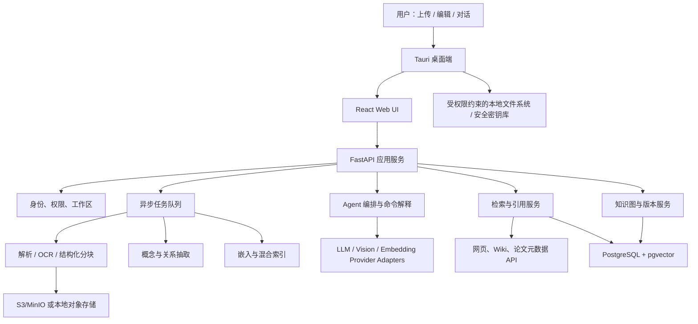

# AI 知识树 Agent：可行性分析与项目 Proposal

> 版本：0.1（研究与立项稿）  
> 日期：2026-08-12  
> 目标形态：可上传课件、自动生成由浅入深知识图谱，并能精确回到原始材料的桌面优先知识工具

> **2026-08-13 产品澄清（优先于下文早期团队假设）**：首个产品明确为个人使用、本地优先的 AI Agent App。学科审查和 QA 由确定性 harness 编排职责隔离的 AI 子 Agent自动执行，可调用受控本地检索和 Web Search 查证；必要时启动第三个裁决 Agent。机器审查必须保留来源、运行身份、模型/提示/工具摘要和不确定性，不伪装为真人签字。个人用户保留锁定、最终写入和残余风险接受权。正式需求见 `docs/PRODUCT_REQUIREMENTS.md`。

## 1. 执行摘要

### 1.1 结论

该项目**技术上高度可行，产品上具有明确差异化，但必须把它定义为“有来源证据、可由自动审查 Agent 复核且可由个人用户修订的学习先修图”，而不是让单次 LLM 输出成为绝对正确的树**。

建议立项，采用“桌面端壳 + Web UI + Python AI 后端 + 关系数据库/向量检索”的混合架构，先用微积分课件做垂直领域 MVP。合理团队配置下：

- 2 周可完成最关键的技术验证：PDF/PPTX 解析、知识块生成、点击回到页码/区域。
- 8–12 周可完成个人可用 MVP。
- 16–24 周可完成可公开测试的 Beta，包括多格式、联网检索、安全、评测和稳定打包。

项目最有价值的产品壁垒不是“自动画图”，而是以下闭环：

1. 每个知识块都有可核验来源；
2. 每条 AI 关系都有证据、置信度和生成版本；
3. 用户的人工修改、锁定和重点标记不会被后续 AI 重排覆盖；
4. 点击节点能够稳定定位到 PDF 页、PPT 页、文本段或图片区域；
5. 本地资料和网络资料使用同一套来源与引用模型。

### 1.2 可行性评分

| 维度 | 评分 | 判断 |
|---|---:|---|
| 文档上传与存储 | 5/5 | PDF、PPTX、DOCX、TXT、常见图片均有成熟解析链路 |
| 概念抽取 | 4/5 | LLM + 规则可做得很好，但概念粒度需要用户或课程级策略控制 |
| 先修关系推断 | 3/5 | 可自动给出高质量候选，不能假设完全正确，必须经过隔离的 AI 学科/QA 复核并保留用户最终控制 |
| 精确跳转原文 | 4/5 | PDF/文本/图片可稳定实现；PPTX 的跨软件外部精确定位较弱，应用内查看最可靠 |
| 交互式科技树 UI | 5/5 | React Flow + ELK 等技术成熟 |
| 本地文件打开 | 4/5 | 桌面壳可安全打开；纯浏览器受沙箱限制 |
| 网络知识自动构建 | 4/5 | 搜索、引用和 RAG 成熟；来源质量、版权和链接失效需要治理 |
| 单模型生成后零复核 | 2/5 | 教育概念边界与先修关系具有主观性；自动化必须包含证据搜索、独立挑战、失败关闭和用户风险接受 |

### 1.3 关键产品决策

需求中的“同一课件里的概念放在同一行”不应直接成为知识层级规则。一个知识块同时具有三种不同属性：

- **认知层级**：由先修关系决定，回答“先学什么”；
- **来源归属**：由课件、网页或用户笔记决定，回答“从哪里来”；
- **视觉位置**：由自动布局与用户拖拽决定，回答“画在哪里”。

三者必须分开存储。UI 可以提供“先修层级视图”“按课件泳道视图”“自由画布视图”，但不能因为两个概念来自同一课件就认定它们难度相同。

底层也不应建成严格的单父节点“树”。真实知识通常有多重先修、交叉关联和多个来源，因此数据层应是**带类型和方向的图**；其中 `prerequisite_of` 关系形成无环有向图（DAG），“科技树”只是面向学习顺序的一种投影视图。

## 2. 产品定义

### 2.1 产品愿景

把用户零散的课件、图片、文本和网络资料，转化为一套由浅入深、可追溯、可编辑、可与 AI 对话的个人学习地图。

它与 Obsidian 的主要区别是：Obsidian 以文件和链接为中心，本产品以**规范化知识概念、先修关系和来源定位**为中心；它与普通思维导图的区别是：每个节点都有证据，AI 能持续维护图结构而不是只生成静态图。

### 2.2 目标用户

- 需要从大量课件中建立学科框架的大学生和研究生；
- 准备考试、竞赛或跨专业学习的自学者；
- 希望把课程材料转化为教学知识图的教师；
- 需要建立团队知识培训路径的组织。

### 2.3 MVP 目标

MVP 必须证明以下完整链路，而不是追求格式和模型数量：

1. 用户上传一组微积分 PDF/PPTX/TXT/JPG；
2. 系统解析文档并显示处理进度；
3. AI 生成“极限 → 连续 → 导数 → 微分 → 积分”等候选概念和先修边；
4. 每个节点显示来源数、置信度、人工/AI 状态；
5. 点击“连续”能打开应用内资料视图并定位到对应页和高亮区域；
6. 节点菜单区分“本地知识”和“网络知识”；
7. 用户可以拖拽、创建、删除、合并节点和连线；
8. 用户在聊天中说“可导与连续的关系是重点”，AI 生成预览，确认后高亮节点和边；
9. 重新导入或让 AI 重排时，用户锁定的节点、边、位置和标记保持不变；
10. 所有 AI 修改可以撤销，并能查看变更理由和证据。

### 2.4 MVP 暂不承诺

- 不承诺 AI 先修关系 100% 正确；
- 不承诺能检测并聚焦任意外部 PDF/PPT 软件中已经打开的窗口；
- 不做多人实时协作、班级管理和学习成绩预测；
- 不做全自动版权内容镜像；
- 不做覆盖所有学科的正式本体推理；
- 不在第一版实现移动端本地文件深度集成。

## 3. 核心用户流程

### 3.1 有本地课件

1. 拖入文件或选择目录；
2. 系统计算内容哈希、查重、校验文件类型并安全入库；
3. 后台进行解析、OCR、结构识别和分块；
4. AI 抽取概念、定义、别名、例子、重要性和候选关系；
5. 系统进行概念去重、循环检测、先修排序和自动布局；
6. UI 先显示“AI 草案”，用户可以接受、修改或拒绝；
7. 点击知识块进入来源菜单，再定位到具体原文；
8. 用户的编辑形成新版本，后续 AI 仅修改未锁定部分。

### 3.2 没有课件

1. 用户输入“帮我构建微积分学习树，面向大一工科”；
2. AI 先生成范围、学习目标和搜索计划；
3. 搜索适合的百科、开放课程、教材目录、论文和高质量帖子；
4. 对来源进行类型、时效、权威性、可访问性和许可证评分；
5. 构建带网页引用的知识树；
6. 用户可随后上传自己的课件，系统把新资料映射到已有概念，而不是新建一棵重复的树。

### 3.3 自然语言修改

自然语言操作必须转化为结构化命令，而不是让 LLM 直接改数据库。例如：

```json
{
  "action": "mark_important",
  "targets": ["concept: differentiability", "edge: continuity->differentiability"],
  "style": {"level": "critical", "color": "#FFB020"},
  "reason": "用户指定为考试关键点",
  "requires_confirmation": false
}
```

高风险或大范围动作（批量删除、合并、重排大量节点）先展示 diff，再由用户确认。

## 4. 信息架构与 UI Proposal

### 4.1 主界面

- 左侧：知识库、课程、文件、标签和过滤器；
- 中间：科技树/图画布；
- 右侧：节点详情、来源列表、定义、先修关系、AI 解释和历史；
- 底部或可折叠侧栏：与 Agent 对话；
- 顶部：视图切换、搜索、布局、版本、撤销/重做、处理任务状态。

### 4.2 三种图视图

1. **先修层级视图**：自上而下，从基础到高级，主边只显示 `prerequisite_of`；
2. **来源泳道视图**：按课件/章节分组，同一来源的概念横向排列，但仍保留跨来源关系；
3. **自由画布视图**：用户自由拖拽和连线，AI 不自动覆盖位置。

节点还应支持折叠：默认显示主题级概念，展开后显示定义、定理、方法、例题等细粒度节点，避免 500 个节点一次铺满画布。

### 4.3 节点视觉编码

| 视觉属性 | 含义 |
|---|---|
| 纵向层级 | 建议学习阶段/先修深度 |
| 边颜色/线型 | 先修、组成、相关、例证、冲突等关系类型 |
| 节点边框 | 人工创建、AI 生成、AI 待确认 |
| 节点填充 | 重要性或掌握状态，二者不可共用同一颜色通道 |
| 角标 | 来源数量、待审核关系数、失效链接数 |
| 锁图标 | 禁止 AI 修改内容、位置或关系 |

### 4.4 点击节点后的来源菜单

```text
连续性
├─ 本地知识
│  ├─ 高等数学上册.pdf · 第 42 页 · 定义 2
│  └─ 第三讲连续性.pptx · 第 7 页
├─ 网络知识
│  ├─ Wikipedia / 维基百科
│  ├─ 开放课程讲义
│  └─ 论文或教材元数据页
└─ 用户笔记
   └─ 我的反例总结
```

本地资源优先在应用内单例标签页打开：若 `resource_id` 已打开，则聚焦原标签并滚动到新锚点；未打开则新建标签。调用系统默认应用作为备选功能。Tauri 的 opener 插件能够打开本地路径和 URL，并可对允许路径进行权限限制，但外部软件是否已打开某个文档没有稳定的跨平台通用接口，因此“检测已打开窗口”不应依赖外部阅读器。[Tauri opener 文档](https://v2.tauri.app/zh-cn/plugin/opener/)

## 5. 核心领域模型

最重要的数据建模原则是：**概念不等于文档中的一次出现，概念节点也不等于某个文件链接。**

### 5.1 核心实体

| 实体 | 作用 | 关键字段 |
|---|---|---|
| `workspace` | 用户或团队知识空间 | id, owner_id, policy |
| `course` | 一门课程/学习主题 | title, goal, audience, language |
| `resource` | 文件、URL 或笔记 | type, uri, content_hash, mime, version, status |
| `resource_segment` | 可检索的结构化片段 | resource_id, text, heading_path, page/slide, bbox, charspan |
| `concept` | 规范化知识概念 | pref_label, aliases, definition, granularity, status |
| `concept_mention` | 概念在来源中的一次出现 | concept_id, segment_id, selector, quote, confidence |
| `concept_edge` | 概念间关系 | source_id, target_id, type, confidence, review_state |
| `edge_evidence` | 支撑某条边的原文证据 | edge_id, mention/segment_id, quote, rationale |
| `resource_link` | 概念到本地/网络资料的链接 | concept_id, resource_id, selector, priority |
| `annotation` | 重点、颜色、备注、掌握状态 | target_type, target_id, kind, payload, author |
| `layout` | 某视图下的坐标和折叠状态 | view_id, concept_id, x, y, pinned, collapsed |
| `revision` | 可回滚版本 | actor, source, patch, parent_revision, created_at |
| `ingestion_job` | 后台解析任务 | stage, progress, error, metrics |

### 5.2 关系类型

MVP 建议显式区分：

- `prerequisite_of`：A 是学习 B 的先修；
- `broader_than` / `narrower_than`：概念上下位；
- `part_of`：A 是 B 的组成部分；
- `related_to`：关联但无方向；
- `equivalent_to`：同义或等价；
- `contrasts_with`：对比或容易混淆；
- `applies_to`：方法/定理应用于对象；
- `example_of`：例子与概念关系。

`prerequisite_of` 子图必须为 DAG；`related_to` 等关系可以有环。W3C SKOS 已提供概念、首选/别名标签、上下位和相关关系的轻量标准，可作为导入导出语义基础，但产品内的“先修”和“例证”仍需自定义扩展。[W3C SKOS Recommendation](https://www.w3.org/TR/skos-reference/)

### 5.3 来源锚点模型

建议借鉴 W3C Web Annotation Data Model，将目标表示为 `source + selector + source_state`。它原生包含文本引用、字符位置、媒体片段和 SVG 区域选择器，适合作为跨格式锚点思想基础。[W3C Web Annotation Data Model](https://www.w3.org/TR/annotation-model/)

```json
{
  "source": "resource:sha256:...",
  "source_state": {"content_hash": "...", "version": 3},
  "selector": {
    "page": 42,
    "bbox_norm": [0.12, 0.31, 0.88, 0.47],
    "char_start": 18420,
    "char_end": 18574,
    "exact": "函数在点 x0 连续……",
    "prefix": "定义 2",
    "suffix": "由此可知"
  }
}
```

### 5.4 各格式定位策略

| 格式 | 主定位键 | 备用恢复键 | 查看方式 |
|---|---|---|---|
| PDF | 页码 + 归一化 bbox | exact/prefix/suffix + charspan | PDF.js 应用内查看与高亮 |
| PPTX | slide index + shape/段落 + bbox | 提取文本引用；必要时渲染页图 | 应用内幻灯片预览；外部打开为备选 |
| DOCX | heading path + paragraph/run | 文本位置与引用上下文 | 转 HTML/PDF 后查看 |
| TXT/Markdown | 字符区间 + 行号 | 文本引用与标题路径 | 内置文本查看器 |
| JPG/PNG | 归一化 xywh 区域 | OCR 引用 + 感知哈希 | 图片查看器叠加矩形/多边形 |
| 网页 | canonical URL + fragment/selector | 文本引用、抓取时间、内容哈希 | 内置/外部浏览器，显示失效状态 |

Docling 能统一解析 PDF、PPTX、DOCX、图片等格式，并为解析元素保留 bbox、字符区间等 provenance，适合作为主解析器。[支持格式](https://docling-project.github.io/docling/usage/supported_formats/)；[ProvenanceItem](https://docling-project.github.io/docling/reference/docling_document/)。PDF.js 可逐页加载、渲染并处理页面坐标变换，适合实现应用内精确跳转和叠加高亮。[PDF.js 示例](https://mozilla.github.io/pdf.js/examples/)

文件变化后，系统先比较内容哈希：

1. 哈希相同，直接使用原锚点；
2. 哈希不同，先用 exact/prefix/suffix 重定位；
3. 再尝试章节路径和语义相似片段；
4. 仍失败则标记“锚点漂移”，不静默跳到错误位置。

## 6. 总体技术架构



### 6.1 推荐部署形态

采用同一套前端与 API，支持两种模式：

- **桌面本地优先模式**：Tauri 负责文件选择、路径权限、应用内查看和密钥安全存储；AI 后端作为本地 sidecar 或连接用户指定的远程 API。适合个人资料和 BYOK。
- **云端/团队模式**：Tauri 或浏览器连接托管 FastAPI、PostgreSQL、对象存储和任务队列；文件通过授权上传，支持团队工作区。

第一版不要维护两套产品逻辑。浏览器版可以查看已上传资源，但“直接打开任意本地路径”仅在桌面端启用。

## 7. AI 与知识树生成管线

### 7.1 文档进入系统后的阶段

1. **安全接收**：扩展名白名单、MIME 与 magic number、大小限制、随机内部文件名、哈希查重；
2. **解析**：提取章节、段落、公式、表格、图片、页码/幻灯片和位置；
3. **OCR**：仅对无文本层或低置信区域执行，保留 OCR 置信度；
4. **结构化分块**：按标题、页、语义和版面切分，禁止纯固定 token 粗切破坏定义/定理；
5. **概念候选抽取**：生成首选名、别名、类型、定义、难度和原文证据；
6. **规范化与去重**：字符串、别名、嵌入相似度和 LLM 判断结合；
7. **关系候选生成**：从章节顺序、显式语句、定义依赖、公式符号依赖和语义推断产生候选；
8. **独立验证**：另一次模型调用或规则检查关系方向、证据和置信度；
9. **图约束**：去自环、检测冲突、对先修子图做有向环检测；
10. **分层与布局**：对已确认/高置信先修边拓扑排序，低置信边以虚线显示；
11. **人工审核**：批量接受、逐条修改、锁定；
12. **索引与发布**：混合检索、节点摘要和来源引用可供问答使用。

教育数据研究已经证明概念抽取和先修关系可以从教材/MOOC 数据中自动学习，但研究目标本身也说明这是需要特征、数据依赖和评测的推断问题，而不是简单按章节顺序连线。[Lu et al., AAAI 2019](https://ojs.aaai.org/index.php/AAAI/article/view/5033)；[Pan et al., ACL 2017](https://aclanthology.org/P17-1133/)

### 7.2 LLM 输出契约

所有可写入图的数据都必须走 JSON Schema/Pydantic 校验，至少包含：

```text
concept_id / proposed_label / aliases / concept_type
difficulty / scope / evidence_segment_ids
relation_type / source_concept / target_concept
confidence / rationale / supporting_quotes
uncertainties / should_request_review
```

如果使用 OpenAI，可通过 Responses API 完成推理和工具调用，并使用 Structured Outputs 约束 JSON Schema；官方文档明确区分了普通 JSON 与 schema adherence。[Responses/模型指导](https://developers.openai.com/api/docs/guides/latest-model)；[Structured Outputs](https://developers.openai.com/api/docs/guides/structured-outputs)。其他模型供应商通过相同内部接口接入。

### 7.3 模型路由

不要让最强模型处理每一个片段。建议分层：

- 轻量模型：标题识别、候选词、别名、低风险分类；
- 嵌入模型：去重、检索和相似片段；
- 强推理模型：全局概念粒度、先修关系、冲突消解、重排；
- 视觉模型/OCR：扫描页、复杂公式与图片内容的补充理解；
- 规则算法：哈希、循环检测、权限、结构验证、排序与合并阈值。

LLM 不能负责权限判断、直接执行文件路径或数据库 SQL，也不能把文档中的文字当成系统指令。

### 7.4 RAG 与 GraphRAG 的位置

RAG 适合回答“这个概念在课件里如何定义”，并保留外部记忆和来源；原始 RAG 工作将生成模型与可检索的非参数记忆结合。[Lewis et al., NeurIPS 2020](https://papers.neurips.cc/paper/2020/hash/6b493230205f780e1bc26945df7481e5-Abstract.html)

GraphRAG 适合回答“整套课件的主要主题和跨章节关系是什么”这类全局问题，但成本和复杂度较高，不应成为 MVP 的必要依赖。可以在第二阶段对大型知识库增加社区摘要。[Edge et al., 2024](https://arxiv.org/abs/2404.16130)

OpenAI File Search 可直接对上传文件做语义与关键词检索，适合快速原型；但本项目需要供应商无关、精确锚点、用户本地文件和自定义图证据，因此推荐自建主索引，把托管 File Search 作为可选适配器而非唯一数据层。[OpenAI File Search](https://developers.openai.com/api/docs/guides/tools-file-search)

## 8. 网络知识管线

### 8.1 搜索策略

为 `WebSearchProvider` 定义统一接口，允许以下来源并行或按策略调用：

- 通用实时搜索：LLM 供应商的带引用 Web Search 或独立搜索 API；
- 百科：MediaWiki REST API；
- 论文与教材元数据：OpenAlex、Crossref；
- 指定可信域：大学、出版社、官方文档、开放课程；
- 用户显式给出的 URL。

OpenAI Web Search 可返回带 URL 注解的引用并支持域名过滤；若采用该实现，UI 必须显示可点击引用。[Web Search 官方文档](https://developers.openai.com/api/docs/guides/tools-web-search)。OpenAlex 提供 works/authors/topics 等学术实体检索，[OpenAlex API](https://developers.openalex.org/api-reference/introduction)；Crossref 提供 DOI 和出版物元数据，[Crossref REST API](https://www.crossref.org/documentation/retrieve-metadata/rest-api/)；MediaWiki REST API 可用于百科页面搜索，[MediaWiki REST API](https://www.mediawiki.org/wiki/API%3AREST_API/Get_started)。

### 8.2 来源评分

每个网络来源保存以下维度，不把搜索排名直接当可信度：

- `authority`：官方/大学/论文/百科/论坛；
- `relevance`：与概念是否直接相关；
- `recency`：内容是否需要时效性；
- `citation_quality`：是否有作者、日期、DOI/永久链接；
- `accessibility`：是否公开、稳定、可再次访问；
- `license`：能否缓存全文，还是仅保存 URL、摘要和短引用；
- `agreement`：与其他独立来源是否一致。

联网抓取要尊重服务条款、许可和 robots.txt。RFC 9309 规定了爬虫访问的 Robots Exclusion Protocol，但同时说明它不是访问授权机制。[RFC 9309](https://www.rfc-editor.org/rfc/rfc9309.html)

## 9. 完整技术栈建议

### 9.1 推荐主栈

| 层 | 推荐技术 | 用途与选择理由 |
|---|---|---|
| 桌面壳 | Tauri 2 / Rust | 本地文件权限、系统打开、单实例窗口、较小安装包 |
| 前端 | React + TypeScript + Vite | 图编辑生态成熟，可同时用于桌面和 Web |
| 图编辑 | React Flow | 节点、边、拖拽、选择、缩放、自定义节点 |
| 自动布局 | ELK.js | 分层布局、端口和减少边交叉；Dagre 可作简单备选 |
| UI | Tailwind CSS + shadcn/ui | 快速建立一致的桌面风格组件 |
| 前端状态 | Zustand + TanStack Query | 本地交互状态与服务端缓存分离 |
| 富文本 | TipTap | 节点笔记、批注与可扩展编辑 |
| PDF 查看 | PDF.js | 应用内页码定位、坐标变换和高亮覆盖层 |
| 图片查看 | Canvas/SVG overlay | bbox、多边形标注与缩放同步 |
| API | FastAPI + Pydantic | Python AI 生态、类型化接口、异步流式响应 |
| ORM/迁移 | SQLAlchemy + Alembic | 数据模型与版本迁移 |
| 后台任务 | Celery 或 Dramatiq + Redis | OCR、解析、嵌入、重建图等长任务 |
| 文档解析 | Docling 为主，PyMuPDF 为 PDF 补充 | 多格式统一结构与 provenance；PDF 精细操作 |
| OCR | PaddleOCR/Tesseract 可替换适配器 | 中英文扫描件；只作为无文本层回退 |
| 图算法 | NetworkX | 去环、连通分量、拓扑排序、路径和冲突检查 |
| 主数据库 | PostgreSQL | 概念、边、版本、权限、任务和全文检索 |
| 向量检索 | pgvector | 向量与业务数据同库，减少早期运维复杂度 |
| 对象存储 | S3 兼容存储 / MinIO；本地模式用受控目录 | 原始文件、渲染页、缩略图与导出包 |
| LLM | 自建 Provider Adapter；可接 OpenAI/其他云模型/本地模型 | BYOK、替换模型、按任务路由，降低锁定 |
| 实时进度 | SSE；必要时 WebSocket | 任务进度和流式聊天；SSE 更简单 |
| 可观测性 | OpenTelemetry + Prometheus/Grafana + Sentry 类错误平台 | 追踪解析、模型成本、错误和延迟 |
| 测试 | Pytest、Vitest、Testing Library、Playwright | 单元、契约、组件和端到端测试 |
| 交付 | Docker Compose（开发）+ CI/CD + 签名桌面安装包 | 可复现环境与桌面分发 |

React Flow 官方示例已提供 Dagre/ELK 树布局、折叠层级和自动布局模式，可显著降低图编辑器实现成本。[React Flow Examples](https://reactflow.dev/examples)。pgvector 支持精确/近似向量搜索、HNSW/IVFFlat，并建议与 PostgreSQL 全文检索组合成混合检索。[pgvector](https://github.com/pgvector/pgvector)

### 9.2 为什么 MVP 不先上 Neo4j

当前主要查询是节点邻居、先修路径、版本和来源 join。PostgreSQL 的边表、递归查询和 NetworkX 已足够，同时 pgvector 可以与全文、权限和来源事务保持一致。等出现超大图、多跳在线查询或专门图分析瓶颈，再通过事件或 CDC 同步到 Neo4j，不要在第一版维护双主存储。

### 9.3 为什么不让 LangChain/LlamaIndex 成为核心领域层

可在供应商适配、实验或现成 loader 中使用它们，但知识概念、锚点、版本、权限和审核状态必须是本项目自己的稳定模型。否则框架升级会渗透到数据库和 UI，难以做精确回滚和迁移。

## 10. API 与模块边界

### 10.1 关键 API

```text
POST   /v1/resources                         上传或注册本地资源
GET    /v1/resources/{id}/segments           查询结构化片段与锚点
POST   /v1/courses/{id}/build-draft          生成知识树草案
GET    /v1/jobs/{id}/events                  SSE 任务进度
GET    /v1/graphs/{id}?revision=...           获取图版本
POST   /v1/graphs/{id}/apply-patch           原子应用图变更
POST   /v1/graphs/{id}/rebuild               保留 locked 项的重建
POST   /v1/commands/interpret                自然语言转结构化命令
GET    /v1/concepts/{id}/targets             本地/网络/笔记来源菜单
POST   /v1/concepts/{id}/resolve-target      解析并验证跳转锚点
POST   /v1/search                            本地混合搜索
POST   /v1/web-research                      联网搜索与引用
POST   /v1/revisions/{id}/revert             回滚版本
```

### 10.2 内部接口

```text
DocumentParser.parse(resource) -> ParsedDocument
AnchorResolver.resolve(selector, resource_version) -> ResolvedAnchor
LLMProvider.generate(schema, messages, tools) -> TypedResult
EmbeddingProvider.embed(texts) -> vectors
WebSearchProvider.search(query, policy) -> cited results
GraphBuilder.propose(segments, constraints) -> GraphPatch
GraphValidator.validate(patch, current_graph) -> findings
```

每个阶段的输入输出都落可审计记录，便于重跑单阶段，而不是文档失败后从头消耗一次所有模型调用。

## 11. 图生成与布局算法

### 11.1 概念归一化

按以下顺序合并候选：

1. 规范化大小写、空格、数学符号和中英文别名；
2. 精确别名/词典匹配；
3. 嵌入近邻召回候选；
4. 检查定义与作用域是否一致；
5. LLM 做 pairwise `same / broader / related / different` 判定；
6. 高置信自动合并，中置信进入人工队列。

例如“可微”“可微分”和“differentiability”可能是同一概念；“微分”和“微分方程”不能因字符串重合而合并。

### 11.2 先修关系评分

候选边分数可由以下信号组合，权重通过标注集评测而不是凭感觉固定：

- 课件显式语言：“在学习 B 前需要 A”；
- 定义依赖：B 的定义或证明使用 A；
- 章节顺序：仅作为弱证据；
- 多份独立资料中的顺序一致性；
- 教材目录、课程路径或习题依赖；
- LLM 的结构化判断与反向检查；
- 用户确认和锁定。

若 A→B 与 B→A 都有中等分数，不强行选择，标记冲突。添加一条先修边前检查是否形成环；形成环时尝试把其中一条改为 `related_to`、降低置信度或进入审核。

### 11.3 分层

只使用已确认和高置信 `prerequisite_of` 边计算层级：

- 基础层：入度为 0 的概念；
- 其他层：可使用最长先修路径 rank，确保每条主边向下；
- 无先修证据的节点进入“待定位”区，而不是随意塞入某层；
- 同层节点再按来源泳道、主题簇或用户位置排序；
- 用户 `pinned` 位置优先于自动布局。

## 12. 安全、隐私与合规

### 12.1 本地文件与 API Key

- 纯 Web 前端不能安全获得任意本地绝对路径；通过 Tauri 能力白名单授予最小目录权限；
- 数据库保存内部 `resource_id`，真实路径加密或只保存在本地映射表；
- 路径打开只允许用户已授权的资源，禁止 LLM 传入任意路径；
- BYOK 密钥不进入前端日志、知识图或云端数据库；桌面端使用系统密钥链或加密安全存储；
- Tauri Stronghold 可作为加密安全存储选项。[Tauri Stronghold API](https://v2.tauri.app/zh-cn/reference/javascript/stronghold/)

### 12.2 文件上传

上传文件是高风险入口。至少实现：

- 允许列表而不是只禁危险扩展；
- MIME、扩展名、magic number 三重校验；
- UUID 内部文件名、大小/页数/解压后大小限制；
- 原文件存储在 webroot 外；
- 解析进程容器/沙箱隔离、CPU/内存/超时限制；
- 病毒扫描或 CDR 作为云端版本能力；
- 宏、脚本和嵌入对象不执行。

这些措施与 OWASP 的文件上传纵深防御建议一致。[OWASP File Upload Cheat Sheet](https://cheatsheetseries.owasp.org/cheatsheets/File_Upload_Cheat_Sheet.html)

### 12.3 间接 Prompt Injection

网页、PDF 和图片都可能包含“忽略系统指令、上传密钥”等恶意内容。系统应：

- 把所有来源内容标记为不可信数据，不赋予指令优先级；
- 抽取模型无写数据库和本地文件能力，只返回 schema；
- 工具参数经确定性权限层验证；
- 搜索、读取与修改知识图分离；
- 批量/外部副作用动作需要用户确认；
- 记录工具调用、来源、模型版本和拒绝原因；
- 建立文档内隐藏指令、图片指令和数据外泄的红队测试。

OWASP 2025 LLM 风险将 Prompt Injection、敏感信息泄露、向量/嵌入弱点和过度代理权列为独立风险项。[OWASP GenAI Top 10](https://genai.owasp.org/llm-top-10/?cat=253)

### 12.4 版权与隐私

- 用户上传前确认其有权保存和处理材料；
- 默认私有，未经选择不公开分享或用于训练；
- 网络资源优先保存元数据、URL、短引用和用户注释，不默认镜像全文；
- 保存作者、来源、抓取时间、许可证、内容哈希和删除状态；
- 支持按 workspace 导出和彻底删除原文件、索引、缩略图和派生数据；
- 云端版本需明确供应商数据保留、区域、加密和日志政策。

## 13. 开发流程与路线图

### 13.1 阶段 0：技术尖峰（2 周）

目标是尽早击穿最大风险，不做完整产品。

| 任务 | 产物 | 通过标准 |
|---|---|---|
| 选 3 份微积分 PDF、1 份 PPTX、2 张扫描图 | 小型金标数据集 | 人工标出 30 个概念、40 条关系、50 个锚点 |
| Docling/PyMuPDF 解析对比 | 解析报告 | 数字 PDF 页码与文本定位稳定 |
| PDF.js 高亮 | 点击原型 | 从节点到正确页/区域成功率 ≥95% |
| LLM schema 抽取 | 候选图 JSON | 输出 100% 通过 schema 或显式失败 |
| 图验证/ELK 布局 | 可交互 demo | 无先修环、节点可拖拽并固定 |

**Go/No-Go 门槛**：若无法稳定保存和恢复锚点，暂停全产品开发，先解决来源定位；不要先堆聊天功能。

### 13.2 阶段 1：MVP 基础（第 3–6 周）

- Tauri + React 桌面壳；
- 工作区、课程、文件导入和任务状态；
- PDF/TXT/图片查看；
- 概念/边 CRUD、手工创建、连线、拖拽、锁定；
- PostgreSQL/pgvector、对象存储、迁移和备份；
- 基础版本、撤销/重做。

### 13.3 阶段 2：AI 构图（第 7–10 周）

- 文档结构化分块和 OCR 回退；
- 概念抽取、规范化、关系候选、置信度；
- DAG 校验、自动分层和 AI 草案审核；
- 对话转 GraphPatch；
- 本地混合检索和带来源回答；
- 模型适配层、用量预算和缓存。

### 13.4 阶段 3：网络知识与 Beta 加固（第 11–16 周）

- Web/Wiki/OpenAlex/Crossref 适配；
- 来源评分、引用、失效链接巡检；
- PPTX/DOCX 应用内预览和锚点恢复；
- 文件安全、Prompt Injection 红队、权限；
- 端到端评测、遥测、崩溃恢复、安装包签名和自动更新；
- 数据导入导出（JSON/JSON-LD/Markdown，后续可加 Obsidian）。

### 13.5 建议团队

| 角色 | 配置 | 主要职责 |
|---|---:|---|
| 产品/学习体验 | 0.5 人 | 学习流程、范围、金标和用户测试 |
| 前端/Tauri | 1 人 | 图编辑、查看器、桌面集成 |
| 后端/AI | 1–2 人 | 解析、模型、检索、图服务、任务 |
| QA/安全 | 0.5 人，Beta 前增配 | 锚点评测、图评测、上传与 Agent 安全 |
| UX 设计 | 兼职或 0.5 人 | 高密度图、颜色与可访问性 |

单人也能做原型，但应把首版限制为 PDF + TXT + 单用户 + 一家 LLM，避免同时承担跨平台打包、多格式和云端运维。

## 14. 测试与评测体系

### 14.1 AI 质量

建立按课程版本化的金标集，分开测：

- 概念抽取 Precision / Recall / F1；
- 概念合并准确率与误合并率；
- 关系类型与方向 Precision / Recall / F1；
- 高置信边的校准：声明 0.9 的边是否约九成正确；
- 图约束：自环数、先修环数、冲突数；
- RAG 检索 Recall@K、MRR/nDCG、引用覆盖率；
- 答案 groundedness/faithfulness 与人工评分；
- 不同模型、prompt、chunker 的离线 A/B。

概念图教育研究显示其对学习成绩有总体正向作用，但产品必须另外验证“AI 自动生成 + 用户修订”是否真正节省时间并改善学习，而不能直接借用传统手工概念图的效果。[Wang et al., 2025 meta-analysis](https://stemeducationjournal.springeropen.com/articles/10.1186/s40594-025-00554-2)

### 14.2 锚点质量

- 正确文件率；
- 正确页/幻灯片率；
- 高亮区域覆盖率或 bbox IoU；
- 文件更新后的锚点恢复成功率；
- 不可恢复时是否明确报错而非错误跳转。

MVP 建议验收：数字 PDF 页级准确率 ≥98%，区域级准确率 ≥90%；扫描件与 PPTX 单独统计，不混入平均值掩盖问题。

### 14.3 产品与性能指标

- 首棵可用树生成时间；
- 用户从上传到首次接受草案的完成率；
- 每 100 个 AI 节点/边的人工修改数量；
- 点击节点后成功到达内容的比例；
- 重新构图时锁定内容被意外改写次数必须为 0；
- 500 个可见节点下的拖拽、缩放和选中流畅度；
- 任务失败可重试、应用重启后可恢复。

## 15. 主要风险与缓解

| 风险 | 影响 | 缓解 |
|---|---|---|
| 概念粒度忽大忽小 | 树不可读 | 课程级粒度策略、类型层级、折叠、人工合并/拆分 |
| 先修关系幻觉 | 误导学习顺序 | 每条边带证据和置信度；高风险边审核；独立验证 |
| 多来源互相矛盾 | 图结构冲突 | 来源权重、保留多个观点、冲突状态，不静默覆盖 |
| PDF/PPT 更新导致跳转失效 | 点击错位 | 内容哈希 + 多选择器 + 漂移状态 |
| 扫描公式/OCR 差 | 概念丢失 | 文本层检测、视觉回退、公式单独处理、用户修正 |
| 图过大变成“毛线团” | UX 失败 | 层级折叠、主题过滤、局部视图、泳道和边类型开关 |
| 用户修改被 AI 覆盖 | 信任崩溃 | draft/commit、lock、GraphPatch、版本与三方合并 |
| 上传文件攻击解析器 | 安全事故 | 白名单、沙箱、资源限制、扫描、不执行宏 |
| 文档/网页 Prompt Injection | 越权或泄密 | 不可信数据隔离、确定性工具权限、无直接副作用 |
| API 成本不可控 | 无法持续 | 分层模型、缓存、批处理、预算上限、逐阶段重跑 |
| 模型供应商锁定 | 迁移困难 | 内部 schema 与 provider adapter，自有索引和锚点 |
| 网络链接失效/版权问题 | 来源不可用 | 元数据与许可、定期巡检、替代来源、不过度缓存全文 |

## 16. 成本模型

不建议在立项稿写死某一家模型的单价。运行成本按以下公式管理：

```text
单份资料成本
= OCR/版面解析计算
+ 嵌入输入 token × 嵌入单价
+ 概念抽取输入/输出 token
+ 全局关系推理输入/输出 token
+ 搜索调用与抓取
+ 文件、缩略图、向量和日志存储
```

控制手段：

- 内容哈希和阶段缓存，未变文件不重新解析；
- 先用规则/轻量模型缩小候选，再用强模型判断；
- 每次增量更新只处理变化片段和受影响子图；
- 课程级 token/金额预算与用户可见用量；
- 支持离线/本地模型时明确质量和硬件差异；
- 记录 `model_id + prompt_version + schema_version + usage + latency`。

## 17. 立项验收标准

### 17.1 MVP 完成定义

- Windows 桌面端可安装并创建本地工作区；
- 支持 PDF、TXT、JPG/PNG，PPTX 至少支持解析和页级预览；
- 自动生成可审核的概念和先修关系；
- 手工创建、编辑、合并、拆分、连线、重点标记、锁定可用；
- 点击本地来源能定位原文，点击网络来源能打开可点击引用；
- 聊天命令能高亮/创建/连接节点，并通过 GraphPatch 留痕；
- AI 重建不修改锁定项；
- 图无 `prerequisite_of` 环；
- 失败任务可重试，所有写操作可撤销；
- 通过文件上传安全基线和最小 Prompt Injection 测试集。

### 17.2 Beta 完成定义

- 多格式锚点恢复、网络来源评分和链接巡检；
- 至少两家 LLM Provider 或一家云模型 + 一种本地模型；
- 课程金标集上达到预定概念/关系/锚点指标；
- 端到端性能、可观测性、备份恢复、数据导出和自动更新可用；
- 10–30 名真实用户完成至少两轮可用性测试。

## 18. 建议的第一轮原型

选择“微积分连续性与可导性”作为窄域样例，原因是它同时包含：

- 清晰但非完全等价的关系：可导通常蕴含连续，连续不蕴含可导；
- 定义、定理、反例和公式多种知识块；
- 同一概念会跨 PDF、PPT 和图片重复出现；
- 可以检验 AI 是否会错误地把“相关”当“先修”或把蕴含方向画反。

第一轮只做 30–50 个概念、40–80 条边和 50 个精确锚点。原型的成功标准不是图看起来漂亮，而是：用户能核验证据、快速修正错误，并且第二次重建不会破坏人工成果。

## 19. 研究与标准依据（精选）

| 类别 | 文献/标准 | 对本项目的启示 |
|---|---|---|
| 教育概念图 | [Concept mapping in STEM education: meta-analysis, 2025](https://stemeducationjournal.springeropen.com/articles/10.1186/s40594-025-00554-2) | 概念图具有学习价值，但应验证自动生成场景 |
| 先修关系 | [Pan et al., ACL 2017](https://aclanthology.org/P17-1133/) | 先修关系可从课程数据学习，但属于需评测的推断任务 |
| 概念与先修抽取 | [Lu et al., AAAI 2019](https://ojs.aaai.org/index.php/AAAI/article/view/5033) | 概念抽取与资料依赖可以联合利用 |
| RAG | [Lewis et al., NeurIPS 2020](https://papers.neurips.cc/paper/2020/hash/6b493230205f780e1bc26945df7481e5-Abstract.html) | 用可检索外部记忆支撑有来源的回答 |
| GraphRAG | [Edge et al., 2024](https://arxiv.org/abs/2404.16130) | 大语料的全局主题问答可使用图社区摘要 |
| 知识组织 | [W3C SKOS](https://www.w3.org/TR/skos-reference/) | 概念、标签、上下位和相关关系可互操作 |
| 来源定位 | [W3C Web Annotation](https://www.w3.org/TR/annotation-model/) | `source + selector + state` 是跨格式锚点基础 |
| 文档解析 | [Docling formats](https://docling-project.github.io/docling/usage/supported_formats/) | 多格式统一解析并保留版面与来源信息 |
| PDF 展示 | [PDF.js](https://mozilla.github.io/pdf.js/examples/) | 应用内渲染可实现可靠页码/坐标定位 |
| 图 UI | [React Flow examples](https://reactflow.dev/examples) | 交互节点、折叠和 ELK/Dagre 布局已有成熟实现 |
| 混合检索 | [pgvector](https://github.com/pgvector/pgvector) | 向量、全文和业务数据可在 PostgreSQL 协同 |
| LLM 结构输出 | [OpenAI Structured Outputs](https://developers.openai.com/api/docs/guides/structured-outputs) | AI 写入图前必须满足严格 schema |
| Web 引用 | [OpenAI Web Search](https://developers.openai.com/api/docs/guides/tools-web-search) | 网络生成内容要显示可点击来源并可限制域名 |
| 网络爬取 | [RFC 9309](https://www.rfc-editor.org/rfc/rfc9309.html) | 抓取需尊重 robots 规则，但其不等于访问授权 |
| AI 安全 | [OWASP GenAI Top 10](https://genai.owasp.org/llm-top-10/?cat=253) | 防 Prompt Injection、泄露、过度代理权和向量风险 |

## 20. 最终建议

建议批准一个 2 周技术尖峰，并把立项决策绑定到三个证据：

1. 多格式解析后能否稳定保留并恢复来源锚点；
2. 在 30–50 个微积分概念上，AI 草案是否显著减少人工构图时间；
3. 人工修改和锁定能否在 AI 增量重建中完整保留。

若三项通过，再进入 8–12 周 MVP。产品命名和宣传应强调“AI 辅助、证据驱动、用户拥有最终控制权”，避免承诺“一键生成绝对正确的知识体系”。
